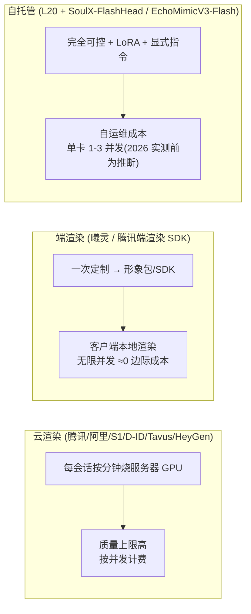

# 照片驱动实时数字人 —— 方案全景调研(2026-07, 第二轮补充)

> 调研时间: 2026-07-31(首轮)+ 2026-07-31 二轮补充 · 目的: 评估是否有比 Vidu S1 更优的方案
> 评估维度: 照片驱动 / 实时性 / **表情动作内容一致性(核心诉求)** / LLM 驱动 / API 可用性 / 成本
> 配套文档: [`photo-avatar-realtime.md`](./photo-avatar-realtime.md)(产品架构)、[`duix-avatar.md`](./duix-avatar.md)(Duix.Avatar 分析)
> 二轮补充范围: 腾讯/阿里待确认项已解决; 新增讯飞、Tavus、HeyGen LiveAvatar、Hedra、开源实时引擎(SoulX-FlashHead 等)与 2026 分层架构洞察

> **⚠ 可信度声明**: 本文所有性能/能力数字均来自**厂商官方宣称**(官网/API 文档/新闻稿/第三方转载/论文自报), **未经独立评测**。部分候选(黑狐)仅见软文宣传, 已剔除。标注 [INFERENCE] 的为本文推断, [VERIFY] 为需实测/商务确认。任何数字用于决策前必须实测。

---

## 1. 结论先行(2026-07 二轮更新)

**格局在 2026-07 发生了实质性变化: 两个"待确认"国产候选转正, 海外出现情绪控制更强的 Tavus, 开源侧首次出现单卡实时流式引擎。**

1. **国产自助 API 最优组合是腾讯云数智人**: 2D 照片定制已确认支持(`IMAGE_PHOTO` 自助 API, 快速版 ~10 分钟) + 云渲染 WS 实时驱动(流式文本/PCM + **Interrupt 打断**) + 端渲染 SDK 选项 —— 是**唯一"照片定制 + 实时对话"全部公开可查**的国产方案
2. **架构契合度最高的是阿里云 avatar-dialog**: 照片免训形象 9.9 元/个 + 实时对话 WS 纯音频流驱动(PCM)→ 业务侧完全掌控 LLM+TTS, 0.01 元/秒透明计价 —— 但邀测制 + 自定义形象直连待实测 [VERIFY]
3. **情绪控制的新标杆是 Tavus CVI(海外)**: Phoenix-4 渲染 40fps、10+ 实时情绪状态、`<emotion>` 显式标签 + Raven-1 用户情绪感知闭环、照片 face API —— 全面超过 D-ID V4 的预设 sentiment
4. **讯飞 2026-07-30 发布"超拟人实时生成"**: 一张照片 + 语义驱动表情/肢体 + 7×24 流式无漂移 —— 方向最贴合"表情与内容一致", 但 API 形态未公开, 需商务验证 [VERIFY]
5. **开源侧突破**: SoulX-FlashHead 1.3B(Apache-2.0)宣称单张 RTX 4090 96FPS 流式无限时长 —— L20 本地路线的首选引擎, 不再是 EchoMimicV3 独木桥

推荐策略(分阶段组合, 详见 §6): 前期模式 A 验证用**腾讯云 + 阿里云**(国产, 照片自助), 海外对照用 **Tavus**(情绪通道标杆); 模式 B 差异化引擎升级为 **L20 + SoulX-FlashHead/EchoMimicV3-Flash**, 规模化仍考虑端渲染(曦灵/腾讯端渲染 SDK)。

---

## 2. 候选清单(调研覆盖, 2026-07 二轮更新)

| # | 方案 | 来源可信度 | 一句话定位 |
|---|---|---|---|
| 1 | **Vidu S1**(生数) | 官方 API 文档 + 新闻 | 2026-07 最新, 照片→实时数字人, AR+Diffusion 逐帧, 无限时长; 内测中 |
| 2 | **腾讯云数智人** ★ | 官方文档(API 实证) | **照片定制 ✅**(IMAGE_PHOTO 自助, 快速版 ~10 分钟) + 云渲染 WS 实时驱动 + **Interrupt 打断** + 端渲染 SDK; 首帧 ~800ms 宣称 |
| 3 | **阿里云 avatar-dialog + 图片免训形象** ★ | 官方文档(API 实证) | **照片 ✅**(免训 9.9 元/个, 训练版 CHAT); 实时对话 WS 纯音频流驱动 + 打断 + 句子级对齐; 0.01 元/秒, 邀测制 |
| 4 | **Tavus CVI**(海外) ★ | 官方 + 第三方定价分析 | **照片 face API**(3-4h 训练); <1s 宣称; Phoenix-4 40fps + **10+ 实时情绪状态** + `<emotion>` 标签 + Raven-1 感知闭环; 完全外部化 LLM |
| 5 | **讯飞星火/智作** ★(观察) | 官方 + 科技日报(2026-07-30) | **超拟人实时生成**: 一张照片→语义驱动表情/肢体, 7×24 流式无漂移; 实时照片对话 API 形态未公开 [VERIFY] |
| 6 | **D-ID V4 Expressive**(海外) | 官方 | 实时 agent, <500ms, **显式 sentiment 情绪控制**(预设集合), LiveKit |
| 7 | **HeyGen LiveAvatar / Avatar Realtime API**(海外) | 官方 API + 用户实测 | 单照片 avatar; `text_stream` 模式 BYO LLM + **每词时间戳**; HLS 720p; 实测延迟 2.5-5s [VERIFY] |
| 8 | **Hedra Live Avatars**(海外) | 官方 + 报道 | 照片 + LiveKit, 宣称 sub-100ms(渲染级)/$0.05 每分钟, 720p —— 便宜快, 情绪控制弱 |
| 9 | **ZEGO 数字人 API**(即构) | 官方文档 | RTC 厂商, 驱动 <200ms / 互动 <1.5s, 照片数字人 1080P, 关键词/动作库驱动; 形象定制人工 1-2 工作日 |
| 10 | **百度曦灵照片数字人** | 官方文档 | **端渲染**: 照片→6MB 形象包, 客户端驱动, 音频驱动 ~100ms; 生动性上限存疑 |
| 11 | **Azure Voice Live + photo avatar** | 官方 | VASA-1 底模, sub-second, 照片 + consent 视频, eligibility 制; 无情绪标签控制 |
| 12 | 阿里云 3D DVH | 官方 | 3D 实时对话, 非照片写实 → 排除 |
| 13 | 字节 Seedance / 即梦 / 可灵 / MiniMax 视频 | 官方 | 全部**离线批量**生成, 非实时; Seedance 明确不支持真人照片主体 → 排除(仅作营销素材) |
| 14 | 火山引擎 veRTC 实时对话 | 官方 | 语音优先对话(ASR/LLM/TTS), 数字人形象细节未公开 [VERIFY] → 暂排除 |
| 15 | MiniMax Realtime API | 官方 | 2026-07 正式发布, 实时**语音/文本**多模态, **无视频形象输出** → 仅作语音层参考 |
| 16 | OpenAI Realtime 2.1 / Gemini Live | 官方 | **会话大脑/语音层**, 不渲染任何视频; Gemini Live 音视频会话上限 2 分钟 → 不能做长视频通话大脑 [VERIFY 上限] |
| 17 | Hume EVI | 官方 | 情绪检测环(48 项表达度量)→ 可驱动表情; 无形象渲染; 2026-01 Google DeepMind 挖走核心团队 → 长期路线风险 |
| 18 | NVIDIA ACE | 官方 | 自托管 3D, Audio2Face-3D ~198ms 流式; 非照片 2D → 仅 3D 路线参考 |
| 19 | 商汤如影 / 京东言犀 / 硅基 DUIX / 出门问问 | 官方/报道 | 实时产品存在但**非自助 API 或形象不支持照片** → 排除/商务观察 |
| 20 | Soul Machines | 破产新闻 | **2026-02 破产清算**, 服务停止 → 移除 |
| 21 | 黑狐数字人 | 软文网站 | 指标夸张, 无官方文档支撑 → 不采信 |
| 22 | 本地开源 2026: SoulX-FlashHead / EchoMimicV3-Flash / LiveAvatar / LiveTalking / OpenTalking / CyberVerse / AvatarForcing | GitHub(2026 活跃) | 差异化引擎(L20), 详见 §4.6 与主文档 |

> ★ = 二轮新增/转正候选。二轮解决: 腾讯云 2D 照片(✅ IMAGE_PHOTO)、阿里云照片/自定义形象(✅ 免训 9.9 元 + 训练版 CHAT)。

---

## 3. 核心对比矩阵(2026-07 二轮更新)

### 3.1 云 API 候选(模式 A)

| 维度 | 腾讯云数智人 ★ | 阿里 avatar-dialog ★ | Vidu S1 | 讯飞星火 ★ | D-ID V4 | Tavus CVI ★ | HeyGen LiveAvatar ★ | ZEGO | 曦灵 | Azure | Hedra ★ |
|---|---|---|---|---|---|---|---|---|---|---|---|
| **照片驱动** | ✓ IMAGE_PHOTO 自助(快速版 ~10min) | ✓ 免训 9.9 元/个 + 训练版 CHAT | ✓ 上传照片 | ✓ 一张照片(2026-07-30 新技术) | ✓ 单照 | ✓ image-to-face API(3-4h 训练) | ✓ 单张 1080p 照片 | ✓ 照片 1080P | ✓ 照片→形象包 | ✓ 照片+consent | ✓ 照片 |
| **实时性(厂商宣称)** | 首帧 ~800ms, 端到端 1-3s | 无官方数字(博客目标 0.8s) | 540P 25-42FPS 无限时长 | 语音版 <0.5s; 视频新发布未公布 | <500ms E2E / <120ms 核心 | <1s utterance-to-utterance | 无官方数字; **用户实测 2.5-5s** | 驱动 <200ms, 互动 <1.5s | 音频驱动 ~100ms | sub-second | sub-100ms(渲染级, 非 E2E) |
| **表情/情绪控制** | 弱显式(文本动作插入); 无 sentiment 参数 | expressiveness: ENTHUSIASTIC/NORMAL(免训形象) | 隐式(不可精细控) | **语义驱动表情/肢体**(隐式) | **显式 sentiment 预设集** + EQ | **10+ 实时情绪状态 + `<emotion>` 标签 + 感知闭环** ★最强 | 实时 API **无情绪参数**(OpenAPI 确认); 全链路有 | 关键词驱动动作 + 动作库 | 隐式 | 无情绪标签 | 弱 |
| **LLM 驱动** | 流式文本/PCM 音频 WS(外部 LLM 自接 ✓) | **纯音频流驱动(外部 LLM+TTS 完全可控 ✓)** | text_msg WS | 内置星火(外部端点未见) | chat API + 外部 LLM key | **全层外部化**(自定 LLM 端点 + 工具调用) | `text_stream` 模式 BYO LLM + 每词时间戳 | 方案2 业务侧文本/音频流 | 文本驱动 | TTS 文本驱动 | 搭配 OpenAI |
| **打断/Interrupt** | ✓ Interrupt + 插播 | ✓ ChangeAvatarStatus | 未明确 | 未明确 | ✓ | ✓ Sparrow 语义级 turn-taking | 全链路 ✓; LITE+外接 TTS ✗ | ✓ 打断 | 未明确 | 未明确 | 未明确 |
| **渲染形态** | 云渲染 + **端渲染 SDK** | 云/端渲染 | 云渲染 | 云 | 云渲染 | 云(WebRTC) | HLS 720p | 云渲染 | **端渲染**(6MB 包) | 云渲染 | 云(LiveKit) |
| **定价信号** | 按并发数购买(单价未公开 [VERIFY]) | **0.01 元/秒**(邀测, 免费 600s); 照片 9.9 元/个 | 内测未定 | 未公开 [VERIFY] | ~$0.78/min(第三方) | ~$0.32-0.37/min 超额(第三方) | $0.05/秒 ≈ $3/min; LITE 1 积分/min | 宣传低成本 | 定制收费 | 按用量 | ~$0.05/min |
| **区域/状态** | 国内/成熟 | 国内/邀测 | 国内/Beta | 国内/GA+新技术 | 海外/企业级 | 海外/GA | 海外/GA | 国内/成熟 | 国内/成熟 | 海外/eligibility | 海外/GA |

★ = 二轮新增/转正。D-ID/Tavus 的"情绪标签→表情"是显式 API 通道; 国产全部为隐式或弱显式 —— 这是模式 B(本地显式层)的差异化空间。

### 3.2 会话大脑/语音层(不渲染形象)

| 维度 | OpenAI Realtime 2.1 | Gemini Live | Hume EVI | MiniMax Realtime |
|---|---|---|---|---|
| **定位** | 全双工语音 agent 大脑(2026-07-06 发布 2.1, p95 延迟 -25% 宣称) | 原生音频 WebSocket(目标 <300ms 宣称; 实测 p50 ~1.4s) | 情感语音接口(48 项表达度量, ~300ms 宣称) | 语音/文本实时多模态(2026-07 GA) |
| **视频形象** | ✗ 无(官方明确 no video) | ✗ 无; 音视频会话上限 **2 分钟** | ✗ 无 | ✗ 无 |
| **打断** | ✓ semantic_vad + interrupt_response + truncate | ✓ VAD + barge-in | ✓ | ✓ |
| **对我们的意义** | 可作模式 A/B 的"大脑+语音"层, 渲染交给数字人引擎 | 会话上限排除长视频通话 [VERIFY] | **SER→LLM→表情环**的现成实现(情绪度量可直接驱动 Tavus/D-ID 表情) | 语音层参考 |

### 3.3 开源实时引擎(模式 B, 2026-07 状态)

| 引擎 | 实时性(厂商/论文宣称) | 照片 | 表情控制 | 显存/许可 | 状态 |
|---|---|---|---|---|---|
| **SoulX-FlashHead 1.3B** ★ | Lite 96FPS 单 4090(6.4GB), 流式无限时长(KV-cache 块自回归) | ✓ 图+音频 | 无显式通道 [VERIFY] | Apache-2.0 | 2026-05 活跃 |
| **EchoMimicV3-Flash 1.3B** | 8-step, 12GB, 768² | ✓ | **音频+文本双条件**(prompt 级情绪) | Apache-2.0 | 2026-03 活跃 |
| **LiveAvatar 14B**(阿里夸克) | 45FPS 需 5×H800; **单 L20 只能离线**(FP8) | ✓ | 无显式情绪 | Apache-2.0 | ECCV26 Oral, 2026-07 |
| **AvatarForcing** | ~500ms 单 H100(14GB), 扩散强制流式; **DPO 训练 listening 微动** | ✓ | 隐式 | 待查 | CVPR26 |
| **LiveTalking** | MuseTalk 72FPS/4090(自测); WebRTC + barge-in + LLM + idle | ✓(后端相关) | 动作库 | Apache-2.0 | 2026-07 活跃, 8.6k★ |
| **OpenTalking** | 完整产品管线(TTFO 指标化), 本地 SenseVoice+CosyVoice 配方 | ✓ | 无 | Apache-2.0 | 2026 活跃, 2.6k★ |
| **CyberVerse** | 照片→实时视频通话 agent(WebRTC + 记忆 + 工具 + idle 呼吸) | ✓ | 无 | GPL-3.0 | 2026-07, 1.5k★ |
| **Hallo3** | 文本+音频双驱动; 非实时(分钟级/片段) | 参考图 | 文本 prompt 表情 | MIT(查 CogVideo-5B 许可) | 2025-03 后停滞 |
| **Hallo-Live** | 20.38FPS/0.94s(2×H200); **文本驱动非照片** | ✗ | — | MIT | ACM MM26 |
| **MuseTalk** | 口型专用 30-120FPS; 无表情通道 | 参考图 | ✗ 仅口型 | 代码 MIT/权重 OpenRAIL-M(查商用条款) | 2025-09 后慢 |
| **LivePortrait** | ~12.8ms/帧 4090; landmark 路线 | 参考图 | **显式 exp_ratio 眼神/嘴唇参数** | 代码 MIT/权重自定义许可 | 2026 仅文档维护 |
| **PersonaLive / FasterLivePortrait** | 流式 diffusion / ONNX 实时 | ✓ / landmark | 弱 / 无 | Apache-2.0 / MIT | 备选 |

---

## 4. 深度评估(2026-07 二轮: 首轮四名 + 新增六名)

### 4.1 D-ID V4 Expressive —— 情绪控制被做成 API 参数的方案

- **对核心诉求最贴合**: `sentiment` 参数(friendly / excited / professional / empathetic / frustrated 等)+ EQ 情绪控制 + 上下文敏感表情 + 情绪对齐语音 —— 是目前**云方案中唯一把情绪控制暴露为 API 参数**的(ZEGO 只有关键词/动作库, S1 为隐式, 本地 EchoMimicV3 的文本通道更自由但不属于云 API)
- LLM 完全可外部化(`agentManager.chat` + 自定义 OpenAI 兼容端点), 与 Orchest 编排天然契合; 有 MCP 应用
- 轻量: ~3.5GB GPU / 4 并发会话
- **短板**: 海外服务(国内访问延迟、数据合规); V4 企业级定价; 情绪是预设集合, 粒度有限(手势/动作级控制没有)

### 4.2 ZEGO 数字人 API —— 实时性最强的国产方案

- 驱动 <200ms / 互动 <1.5s(全链路最低 <1s), RTC 厂商的传输底座
- 照片数字人(真人/卡通)1080P; 关键词驱动动作、自定义动作库、指向性动作、打断 —— 有弱显式控制
- 两种接入: AI Agent(端到端, 内含对话)或纯数字人 API(业务侧控制"说什么")—— 后者符合"LLM 由 Orchest 驱动"
- **短板**: 照片形象定制是**人工流程**(1-2 个工作日), 不是自助 API; 情绪表达靠动作库, 表情粒度未知

### 4.3 百度曦灵照片数字人 —— 被忽视的"端渲染"路线

- 照片 → 服务端形象定制 → **6MB 形象包** → 客户端 SDK 本地驱动渲染(H5/端)
- 音频驱动延迟 ~100ms(厂商宣称); 一次定制后客户端渲染, **并发成本近似为 0 是本文推断** [INFERENCE]: 形象包生成仍收费, 且渲染质量依赖客户端设备, 需实测
- **这是规模化视角的独特优势**: 云渲染方案(S1/D-ID/ZEGO)每会话都在烧服务器算力, 端渲染只烧客户端
- **短板**: 生动性上限取决于端渲染引擎(照片数字人的表情/动作质量存疑); 无显式情绪通道; SDK 集成深度绑定(非纯 API)

### 4.4 Azure Voice Live —— 备选

- VASA-1 底模, sub-second, 4K, 照片 avatar + consent 流程
- 无情绪标签控制; 海外; eligibility 制 → 仅作对照

### 4.5 Vidu S1 —— 已有结论(见主文档 §3.2)

照片自助 + 无限时长 + 国内, 但隐式表达不可控、Beta 内测。

### 4.6 腾讯云数智人 —— 二轮转正, 国产自助 API 最优组合

- **照片定制已确认**: `POST /v2/ivh/assetmanager/customservice/make`, `MakeType=IMAGE_PHOTO`(2D 小样本照片数字人), 照片 ≤16MB 正脸, `PhotoVersion=0` 快速版(~10 分钟)/`1` 精修版(~1 小时); 另有免训练照片(一张照片 + 文本/音频→口型视频)
- **实时对话**: 云渲染会话交互 WS —— 流式文本(`SEND_STREAMTEXT` 子句/非子句模式)、流式音频(PCM)、**Interrupt 打断**、插播 `IsInsertSentence`、TextStart/TextOver 事件; 厂商 FAQ: 首帧 ~800ms, 端到端 1-3s
- **端渲染选项**: 2D 端渲染 SDK(本地 PCM 流驱动, 透明通道, 高并发)+ 端云混合切换 —— 与曦灵同路线, 可作规模化对照
- **LLM 契合**: 支持纯文本/音频驱动 → 外部 LLM 自接, 符合 Orchest 模式 A 契约 `(text/audio 流 → 音视频流)`
- **短板**: 表情是弱显式(文本动作插入), 无 sentiment 参数; 生动性需实测; 定价按并发数购买, 单价未公开 [VERIFY]

### 4.7 阿里云 avatar-dialog + 图片免训形象 —— 架构契合度最高

- **照片已确认**: 「图片免训版」2D 数字人: 单帧照片(400-7000px, ≤10MB)→ 免训练形象, **API 后付费 9.9 元/个**, 可选 `expressiveness: ENTHUSIASTIC/NORMAL`; 训练版 `CreateTrainPicAvatar`(BizType=CHAT)明确用于实时对话
- **实时对话**: avatar-dialog WS —— `GenerateVideo`(单声道 PCM 音频流)→ **`ChangeAvatarStatus` 打断** → 销毁; `SentenceStarted` 句子级对齐; 1080P RTC 推流; **0.01 元/秒, 邀测制, 免费 600 秒**
- **架构含义**: 纯音频流驱动 = 业务侧完全掌控 LLM + TTS(情绪做进音频/文本), 与 Orchest 模式 A 的"LLM 由我们驱动"最贴合
- **风险**: 邀测门槛; avatar-dialog 当前文档标注公共形象库, 自定义照片 avatar_id 直连需实测 [VERIFY]; 端到端延迟无官方数字

### 4.8 讯飞星火/智作 —— 2026-07-30 发布, 方向最贴合但 API 未公开

- 新技术(科技日报 2026-07-30): 「凭一张照片生成具有**语义驱动表情、肢体与对话**的数字人」, 7×24 实时流式生成、长时无漂移、音画同步; 37 种语言; 语音版超拟人交互 API 宣称延迟 <0.5s(2024 报道)
- 智作 API 已支持照片/视频定制形象(批量); 数字人交互 SDK 为预设 avatar_id(非照片) + 内置星火 LLM
- **关键缺口**: 照片形象 + 实时对话管线的打通、API 形态/定价均未公开 → 建议并行发起商务沟通, 与腾讯/阿里 PoC 互为备份 [VERIFY]

### 4.9 Tavus CVI —— 海外情绪控制新标杆(对照 D-ID)

- **照片 face API**: `POST /v2/faces`(train_image_url + stock voice), 训练 3-4 小时; 或视频训练
- **情绪控制(最强)**: Phoenix-4 实时 40fps 渲染(非 clip 循环), **10+ 情绪状态实时切换**(neutral/angry/excited/elated/sad/contempt/surprised…); 三条通道: `tts_emotion_control` 默认开、`<emotion value="..."/>` 显式 XML 标签、system prompt 驱动
- **感知闭环(真人感)**: Raven-1 感知用户情绪/表情/视线 → Sparrow-1 语义级 turn-taking(非静音检测)定时 → Phoenix 表达 —— "active listening"(用户说话时面部反应 + 眼神接触)+ idle 微动
- **LLM 完全外部化**: 每一层可替换(自定义 LLM 端点 + 工具调用 + 记忆 + 知识库), LiveKit Agent / Pipecat 双集成
- **成本**: 免费 25 分钟; Starter $59/月(100 分钟); 超额 ~$0.32-0.37/分钟(第三方, 2026-06)
- **短板**: 海外(延迟/合规); 照片 face 训练数小时(D-ID 照片近乎即时); <1s 为厂商宣称, 无独立基准

### 4.10 HeyGen LiveAvatar / Avatar Realtime API —— 开发者体验好, 实测延迟存疑

- 2026 实时产品独立为 **LiveAvatar**(liveavatar.com, WebRTC); 单张 1080p 照片可建 LiveAvatar; 原 Interactive Avatar 资产不互通
- **Avatar Realtime API**(v3): `tts`(固定脚本)/`audio`(音频对口型)/`text_stream`(seed text + 推 LLM token 增量)三模式; 输出 HLS; **每词时间戳**(利于文本/语音/视频同步); 会话上限 30s 空闲超时/1h/3 并发
- **实测警示**: 用户实测 speak()→avatar 开口 2.5-3.6s, 常见 2-5s; 实时 API **无情绪参数**(OpenAPI 确认) —— 情绪只能靠 voice_id 间接
- 定价: $0.05/秒 ≈ $3/分钟(自助); LiveAvatar LITE 1 积分/分钟(~$0.10-0.13/分钟 有效)

### 4.11 开源实时引擎 2026 —— 单卡流式已可实现(模式 B 升级)

- **SoulX-FlashHead 1.3B**(Soul AI Lab, Apache-2.0, 2026-05 活跃): 1.3B 蒸馏流式 diffusion, Wan2.1 + LTX-Video VAE; **Lite 宣称 96FPS / 6.4GB / 单 4090 三路 25+FPS 并发**; Pro 10.8FPS(4090); 无限时长(KV-cache 块自回归); 图+音频驱动; 配套 FlashTalk TTS(0.87s)。**L20 ≈ 4090 级 FP16 + 更多显存, 预估 60-90FPS [INFERENCE, 需实测]**; 无显式情绪通道 [VERIFY]
- **EchoMimicV3-Flash 1.3B**(Apache-2.0, 2026-03): 音频 + **文本双条件**(prompt 级情绪/风格), 8-step, 12GB, 768² —— 显式表达路径首选; 作者团队预告 EchoTorrent 14B 流式(无代码)
- **LiveAvatar 14B**(阿里夸克, ECCV26 Oral, Apache-2.0): 45FPS 需 5×H800(4-step + 时序强制流水并行); FP8 可上 48GB 但**离线** —— L20 单卡实时不可行
- **AvatarForcing**(CVPR26): 扩散强制因果流式, ~500ms 单 H100; **DPO 把"非活跃"latent 当负样本训练 listening 微动** —— 真人感方向标杆
- **产品层**: LiveTalking(Apache-2.0, WebRTC + barge-in + LLM + idle 动作编排, 2026-07 活跃)、OpenTalking(Apache-2.0, 完整管线 + TTFO 指标化 + 本地 SenseVoice/CosyVoice 配方)、CyberVerse(GPL-3.0, 照片→实时视频通话 agent, 记忆/RAG/工具/idle 呼吸)
- **2026 实时配方共识**: 4-step 蒸馏(DMD/一致性)+ KV-cache 块自回归; TeaCache 1.5-2.6× 加速; 1-2B 蒸馏模型单卡实时可行, 5B+/14B 单卡不可行

---

## 5. 关键架构洞察: 2026 年的五层分工(二轮更新)

首轮的"云渲染 vs 端渲染 vs 自托管"分叉仍然成立(见下方 mermaid), 但 2026 年的全局事实是:**实时数字人视频通话已解耦为五个独立可替换的层**, 没有任何单一厂商覆盖全部:

| 层 | 职责 | 2026 代表 |
|---|---|---|
| **1. 大脑/语音层** | 全双工语音 agent、VAD、打断、工具调用 | OpenAI Realtime 2.1、Gemini Live、Hume EVI、MiniMax Realtime |
| **2. 情绪编排层** | 感知用户情绪 → 决定目标情绪状态 → 生成表情/动作指令 | Tavus Raven-1 + Hume 表达度量(48 项) |
| **3. 形象渲染层** | 照片/视频训练的形象 + 实时 talking-head 生成 | Tavus Phoenix-4、HeyGen、D-ID、腾讯/阿里云渲染、SoulX-FlashHead(自托管) |
| **4. 传输层** | WebRTC/LiveKit/HLS 音视频同步 | LiveKit Agents、Pipecat、AliRTC |
| **5. Agent 编排层** | LLM 对话循环、记忆、工具、行为节拍 | LiveKit Agents、Pipecat、OpenTalking、Tavus PAL |

**对 Orchest 的含义**: Orchest 天然是层 1+5 的宿主(agent 循环/事件流/工具/provider 墙), 层 2-4 都是 provider 化接口 —— 五层之间通过事件流契约连接, 与 Orchest 的 provider 抽象完全同构。

- **实时性天花板**: 端渲染 > 云渲染(本地无网络/服务器瓶颈); 开源单卡流式(96FPS 宣称)已接近端渲染 —— 均为推断/厂商宣称, 需实测
- **质量天花板**: 云渲染大模型 > 端渲染轻量引擎 > 本地 1.3B 蒸馏(推断) —— 但真人感评测表明"行为真实度"比像素质量更影响观感(见主文档 §5.4)
- **成本曲线**: 端渲染最平, 云渲染线性涨(国产 0.01-0.37 元/分钟级), 自托管固定成本 + 单卡并发上限
- **2026 新事实**: 开源单卡实时已成立(SoulX-FlashHead 宣称 3 路并发), 模式 B 从"备胎"升级为"可选主引擎"; 但显式情绪通道仍是整个行业空白(开源无、国产隐式、仅 Tavus/D-ID 有 API 参数)

---

## 6. 推荐策略(分阶段组合, 2026-07 二轮更新)

| 阶段 | 引擎选择 | 理由 |
|---|---|---|
| **W0 验证**(2 周内跑通 demo) | **腾讯云数智人**(照片快速版) + **阿里云 avatar-dialog**(免训形象, 邀测) 并行 | 国产照片自助 API 已确认; 阿里纯音频驱动契合 Orchest 模式 A; 海外对照开 **Tavus 免费 25 分钟** 验证情绪通道假设 |
| **W2 差异化评测** | 腾讯/阿里/Tavus vs 本地 **EchoMimicV3-Flash + SoulX-FlashHead** | 决定"内容一致性"走隐式(云引擎够用)还是显式(本地文本/标签通道); Tavus 的情绪状态机与本地稀疏标签对比 |
| **规模化阶段** | **端渲染(曦灵或腾讯端渲染 SDK)单独 PoC** | 若产品是高频长会话, 边际成本≈0 是长期胜负手 |
| **差异化引擎(升级)** | L20 + **SoulX-FlashHead**(实时) + **EchoMimicV3-Flash**(显式表达/质量) | 2026 开源单卡流式已可行; LiveTalking/OpenTalking/CyberVerse 提供产品层参考; LiveAvatar 14B 单卡不可行, 放弃 |

**关键决策点(2026-07 更新)**: (a) 情绪通道对比改为 **Tavus(10+ 状态, 最强)vs 本地稀疏标签 vs 国产隐式** —— 若 Tavus 级别的预设情绪状态机满足"表情动作与内容一致"的 80%, 显式层开发成本可大幅削减; (b) **讯飞商务验证**(2026-07-30 新技术)与腾讯/阿里 PoC 并行, 2 周内无结论则忽略; (c) 语音层若走自建模式 B, 大脑可考虑 OpenAI Realtime 2.1 / MiniMax Realtime, 但注意 Gemini Live 音视频会话上限 2 分钟不适合长视频通话。

---

## 7. Orchest 对接含义(2026-07 更新)

- 所有云方案都收敛为同一 provider 契约: `(text 或 audio 流, 可选 sentiment/action 提示) → 实时音视频流`(腾讯流式文本/PCM WS、阿里 PCM WS、Tavus emotion 标签、HeyGen text_stream)
- 差异在控制通道粒度, 契约里保留**可选的表现力提示字段**(sentiment/action/emotion), 无则忽略 —— 显式控制做成 provider 能力位; Tavus 的 `<emotion>` 标签集合是现成的枚举参考
- 端渲染(曦灵/腾讯端渲染 SDK)契约不同: `照片 → 形象包` + `(音频/文本流) → 客户端渲染指令` —— 单独一类 provider
- **大脑/语音层也是 provider**(OpenAI Realtime / MiniMax Realtime), 与形象渲染 provider 解耦 —— 五层分工下的 provider 墙职责边界更清晰
- 前期接入优先级: **腾讯云 → 阿里云 → Tavus(情绪对照) → 讯飞(商务)**, ZEGO/曦灵留作规模化对照

---

## 附: 待跟进事项(2026-07 二轮更新)

已解决(二轮):
- [x] 阿里云 avatar-dialog 照片/自定义形象 —— **支持**: 图片免训版 9.9 元/个 + 图片训练版 CHAT(2025-05-27 API)
- [x] 腾讯云数智人 2D 照片 —— **支持**: `IMAGE_PHOTO` 定制接口(快速版 ~10 分钟/精修版 ~1 小时)
- [x] 本地实时引擎格局 —— SoulX-FlashHead(96FPS 单卡宣称)为新一代首选, LiveAvatar 14B 单 L20 不可行

仍待跟进:
- [ ] Vidu S1 内测申请结果与定价
- [ ] 腾讯云数智人: 照片形象生动性(表情/动作质量)与并发报价实测
- [ ] 阿里云 avatar-dialog: 邀测申请 + 自定义照片 avatar_id 直连 WS 的可行性实测
- [ ] 讯飞 2026-07-30 超拟人实时生成的 API 形态/定价(商务沟通)
- [ ] Tavus CVI: 国内访问延迟 + <1s 宣称的独立实测(与 D-ID <500ms 对照)
- [ ] HeyGen 实测延迟(2.5-5s 用户报告)与 text_stream 模式每词时间戳的同步精度
- [ ] SoulX-FlashHead 在 L20 上的 FPS/显存实测; 显式情绪通道是否存在 [VERIFY]
- [ ] EchoMimicV3-Flash vs SoulX-FlashHead 双盲对比(表达质量 vs 实时性)
- [ ] 百度曦灵照片数字人端渲染的生动性实测(表情/动作质量)
- [ ] ZEGO 照片定制流程的自动化程度与价格
- [ ] Azure Voice Live 的 eligibility 申请条件
- [ ] MuseTalk OpenRAIL-M 权重与 LivePortrait 权重的商用条款确认
- [ ] OpenAI Realtime 2.1 / MiniMax Realtime 作为模式 B 大脑层的实测(成本 + 延迟)
