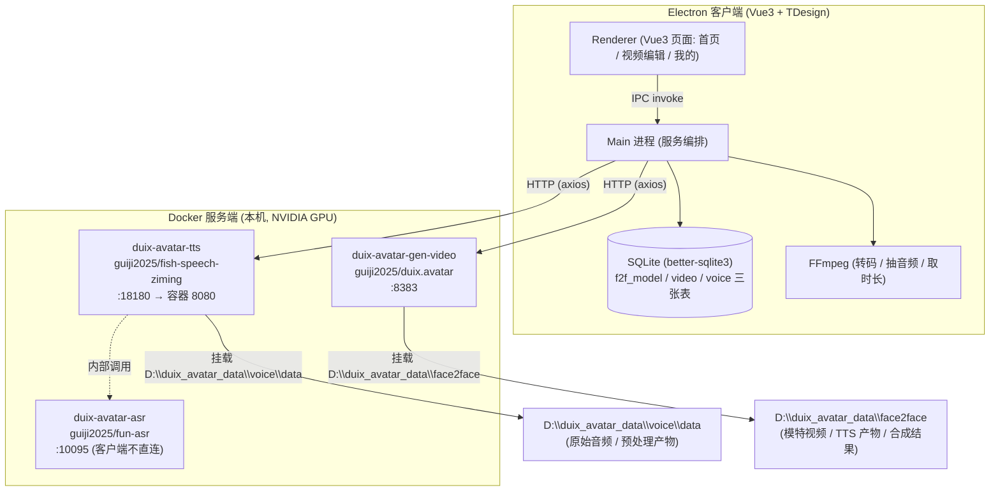
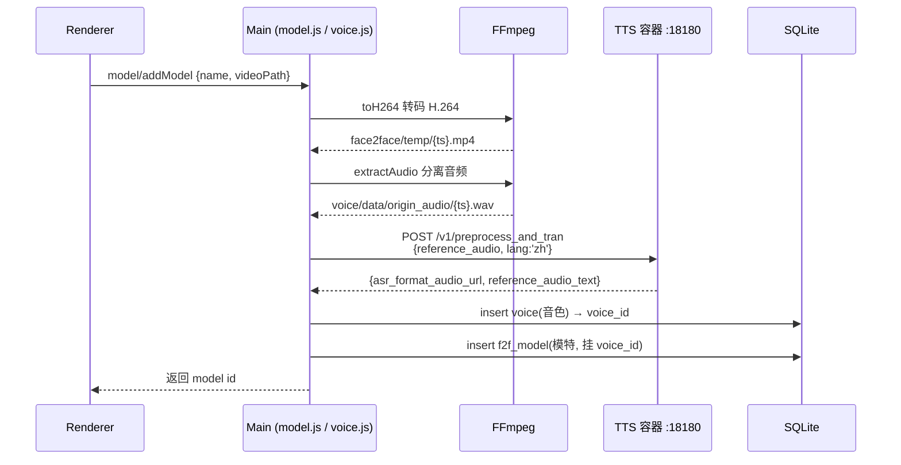
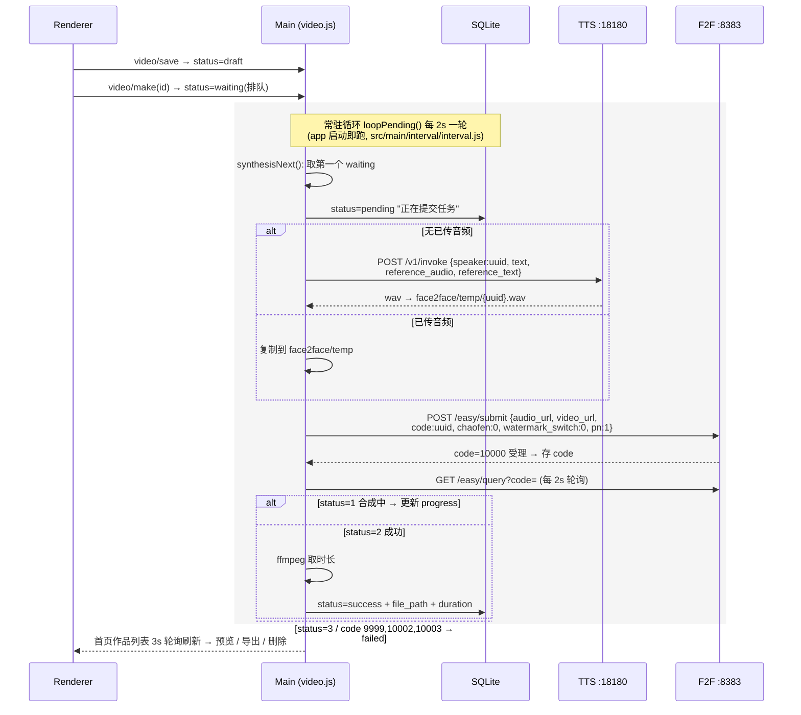

# Duix.Avatar 研究笔记

> 调研时间: 2026-07-31 · 代码版本: v1.0.6 (github.com/duixcom/Duix.Avatar)
> 结论先行: Duix.Avatar 是一套 **全离线数字人(虚拟人)视频合成工具**: 用一段真人拍摄视频克隆"形象 + 音色", 再用文本/音频驱动生成"对口型说话视频"。客户端是 Electron 桌面应用, 推理全部跑在本机 NVIDIA GPU 上的三个 Docker 容器里。

---

## 1. 项目定位

| 维度 | 内容 |
|---|---|
| 是什么 | 开源(社区许可) AI 数字人工具: 形象克隆 + 声音克隆 + 文本/语音驱动的视频合成 |
| 官网 | duix.com (Duix.com 出品, 商用数字人公司开源其本地部署版) |
| 运行形态 | Windows 10+ / Ubuntu 22.04 桌面客户端 + Docker 本地服务端(必须 NVIDIA GPU) |
| 关键特性 | **完全离线**(隐私); 多模特管理; 8 种语言文案; 串行任务队列 |
| 许可证 | DUIX.COM Community License Agreement(自定义社区协议, 非 OSI 开源协议): 免费商用, 但月活 >10 万或年收入 >1000 万美元需另签商业授权 |
| 技术底座 | 三方开源组件: TTS = Fish-Speech(zi ming 变体), ASR = FunASR, 视频合成 = 自研 face2face(音频驱动口型) |
| 非目标 | 不做实时互动(README 明示: 实时互动请用官方 duix.com 服务); 只做**非实时**视频合成 |

与 Orchest 的关系: Duix.Avatar 代表了"数字人视频合成"这条完整产品链路的参考实现 —— 客户端把 ASR/TTS/视频生成三个模型服务编排成一条流水线, 是 Orchest `provider-visual`(image/video AIGC)方向的有价值对标物。

---

## 2. 整体架构



### 2.1 三个容器服务

| 容器 | 端口 | 职责 | 关键接口 |
|---|---|---|---|
| duix-avatar-tts | 18180 | 零样本语音克隆 + TTS 合成(Fish-Speech) | `POST /v1/invoke`(合成), `POST /v1/preprocess_and_tran`(克隆预处理+转写) |
| duix-avatar-gen-video | 8383 | 音频驱动数字人视频合成(face2face) | `POST /easy/submit`, `GET /easy/query?code=` |
| duix-avatar-asr | 10095 | FunASR 语音识别 | **客户端代码从不直连**; 由 TTS 容器内部调用(见 2.2) |

### 2.2 关键推论(代码证据)

- 客户端 `src/main/api/` 只封装了两个服务: `tts.js`(18180)和 `f2f.js`(8383), 全项目 grep 不到 `10095`。
- 语音克隆时客户端调用 `tts /v1/preprocess_and_tran`, 响应里带 `asr_format_audio_url`(ASR 规范化音频)和 `reference_audio_text`(转写文本)两个字段 —— **ASR 被封装在 TTS 容器内部**, fun-asr 容器独立存在但不在客户端调用链上。[INFERENCE: preprocess_and_tran 内部是否调用 fun-asr 容器无法从本仓库确认, 容器是闭源镜像]

### 2.3 数据与存储

- **SQLite**(`src/main/db/sql.js`, 3 个迁移版本):
  - `f2f_model` — 数字人模特: `name, video_path, audio_path, voice_id`
  - `voice` — 克隆音色: `origin_audio_path, lang, asr_format_audio_url, reference_audio_text`
  - `video` — 合成任务/作品: `file_path, status, message, model_id, audio_path, code, progress, duration, text_content, voice_id`
- **磁盘布局**(Windows: `D:\duix_avatar_data\`; Linux: `~/duix_avatar_data/`, 见 `src/main/config/config.js`):
  - `voice/data/` — TTS 容器数据根, 客户端写入 `origin_audio/`(克隆用原始音频)
  - `face2face/temp/` — 模特视频、TTS 产物 wav、合成结果 mp4, 全混在一个目录, 靠时间戳文件名区分

---

## 3. 核心链路 A: 创建数字人模特(形象 + 音色克隆)

触发: 首页「创建模特」→ 上传 ≥8 秒真人视频(mp4/mov, 前端校验时长)+ 命名。



要点:
- 模特 = **视频(形象)** + **音色(克隆声音)** 两个独立资产, 通过 `f2f_model.voice_id` 关联; 默认每个模特带一个自己的克隆音色。
- 音色克隆本身不需要训练循环 —— Fish-Speech 零样本克隆, "训练"只做音频预处理 + ASR 转写, 得到 reference 音频/文本供后续合成时引用。

---

## 4. 核心链路 B: 视频合成(核心流水线)

触发: 「视频编辑」页选模特 → 写文案选音色(或直接上传音频)→ 试听 → 提交合成。



要点:
- **双队列**: 提交时 `waiting`(用户可见排队位置 "n / N"), 轮到后转 `pending`(合成中, 显示服务端 progress%); 一次只跑一个任务(串行)。
- **两种音频来源**: 文案走 TTS 合成; 也可直接上传音频文件(绕过 TTS)。
- **成功判定**: 外层 `code=10000` 表示任务受理, 内层 `data.status`: 1=合成中 / 2=成功 / 3=失败。
- 产出视频只存**相对文件名**在 DB, 前端拼 `assetPath.model` 取绝对路径。

### 4.1 video 状态机

```
draft ──make──▶ waiting ──synthesisNext──▶ pending ──query status=2──▶ success
                                             │  │
                                             │  └─status=3 / 错误码──▶ failed
                                             └─异常(catch)──────────▶ failed
```

---

## 5. 开放 API(客户端直连的两个服务)

TTS `http://127.0.0.1:18180`:

- `POST /v1/invoke` — TTS 合成。参数: `speaker`(随机 uuid)、`text`、`format:wav`、`reference_audio`、`reference_text` 等(其余参数客户端写死: topP 0.7 / temperature 0.7 / max_new_tokens 1024 / chunk_length 100 / repetition_penalty 1.2)。返回 wav 二进制。
- `POST /v1/preprocess_and_tran` — 音色克隆预处理: 输入原始音频 + lang, 输出 `asr_format_audio_url` + `reference_audio_text`。

视频合成 `http://127.0.0.1:8383/easy`:

- `POST /submit` — 提交任务: `{audio_url, video_url, code:uuid, chaofen:0, watermark_switch:0, pn:1}`, 返回 `code=10000` 受理。
- `GET /query?code=` — 轮询进度(见 4)。

---

## 6. 代码结构速览

```
src/
├── main/                          # Electron 主进程 = 全部业务编排
│   ├── index.js                   # 入口: initDB → registerHandler → createWindow
│   ├── service/                   # 业务服务(IPC handler 注册处)
│   │   ├── model.js               # 模特创建: 转码→抽音频→克隆音色→入库
│   │   ├── video.js               # 合成编排: 队列 + TTS + f2f 提交/轮询
│   │   ├── voice.js               # 音色: 克隆(train) / 合成(makeAudio) / 试听
│   │   └── context.js             # 键值配置(协议同意状态等)
│   ├── api/                       # HTTP 客户端: tts.js / f2f.js / request.js(axios 封装)
│   ├── dao/                       # SQLite 数据访问: f2f-model / video / voice
│   ├── db/                        # better-sqlite3 初始化 + 迁移脚本(sql.js)
│   ├── util/ffmpeg.js             # toH264 / extractAudio / getVideoDuration
│   ├── interval/interval.js       # 启动即跑的合成轮询循环 loopPending()
│   └── handlers/                  # 通用能力桥: 文件选择 / 窗口控制 / ffprobe
├── renderer/src/                  # Vue3 + TDesign + Pinia + vue-i18n(中/英)
│   ├── views/home/                # 首页: 作品列表(3s 轮询) + 模特列表 + 创建入口
│   ├── views/video-edit/          # 编辑页: 选模特 → 预览 → 文案/音频 + 试听 → 提交
│   └── components/model-create/   # 创建模特弹窗(上传 ≥8s 视频 + 命名)
└── preload/                       # contextBridge: electron + client(file/app)
```

`src/renderer/src/api/index.js` 是 renderer→main 的 IPC 全量清单(≈20 个 invoke: `model/*`, `video/*`, `voice/audition`, `context/*`)。

---

## 7. 值得注意的工程点

1. **全离线闭环**: 客户端只依赖 127.0.0.1 上的三个容器, 无任何外部云调用; GPU 是硬依赖(无 NVIDIA 卡服务起不来)。
2. **编排全部在客户端主进程**: 队列、状态机、重试、进度都在 Electron main 里, Docker 服务只做"一次请求一次推理"的哑服务 —— 服务端无任务队列概念(客户端保证同时只有一个任务在飞)。
3. **串行 + 双状态轮询**: waiting(本地队列位置)→ pending(远端进度), 两个循环(主进程 2s 任务轮询 / 渲染进程 3s 列表刷新)。
4. **简单粗暴的存储**: 资产文件用时间戳/uuid 命名平铺在 temp 目录, SQLite 只存相对路径; 删除时手动 unlink 文件。
5. **前端是 Vue3 + TDesign 桌面风格**(深色、无边框窗口、自绘标题栏), 中英双语; `webSecurity: false` + `contextIsolation: false`, 安全姿态偏开发向。
6. **对 Orchest 的参考价值**: 数字人产品 = "形象资产 + 音色资产 + 生成服务"三件套; 任务队列与进度轮询放客户端; ASR 作为 TTS 容器内部前置步骤而非独立服务暴露 —— 与 Orchest provider 分层(protocol/core/weight-tier)的对接点在于 `provider-visual`(视频 AIGC)与 ASR/TTS 的编排模式。
