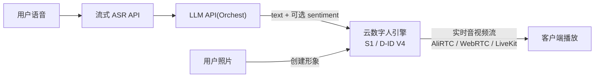
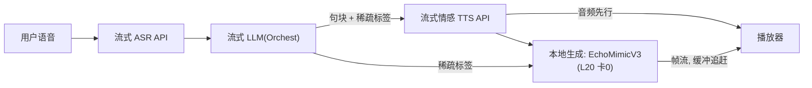
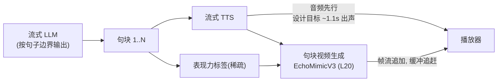

# 照片驱动实时数字人聊天 —— 产品与架构设计

> 创建: 2026-07-31 · 状态: 方案讨论收敛版(待 PoC 验证) · **2026-07-31 二轮补充**: 云引擎候选新增腾讯云/阿里云/Tavus/HeyGen/讯飞; 开源引擎升级(SoulX-FlashHead); 一致性/真人感补 2026 论文证据
> 前置研究: 见同目录 [`duix-avatar.md`](./duix-avatar.md)(Duix.Avatar 架构分析)、[`avatar-api-landscape-2026.md`](./avatar-api-landscape-2026.md)(方案全景调研)

> **⚠ 信息可信度声明**: 本文中所有第三方产品的能力与性能数字(如 "540P 25-42FPS"、"<500ms"、">200ms")均为**厂商官方宣称**(官网 / API 文档 / 新闻稿), **未经独立评测验证**。引用时已尽量标注来源层级, 但任何数字在进入选型决策前都必须实测。本文自己的延迟预算 / 追赶系数等均标注为**设计目标**, 非实测值。

---

## 1. 产品定位

| 维度 | 内容 |
|---|---|
| 形态 | **照片驱动**的 AI 视频实时聊天(数字人对话) |
| 个性化 | 允许 **LoRA 前训练**: 用户上传照片 → 训练形象 → 聊天时加载(不要求零样本) |
| 核心诉求 | **动作、表情、口型与对话内容一致**(内容一致性), 对话由 **LLM 驱动** |
| 硬约束 | **实时**(对话式低延迟, 非批量合成) + **动作表情真实生动** |
| 部署 | 本地 GPU 服务器(2 × NVIDIA L20 48GB)+ WebRTC 推流, 客户端为浏览器/App |

### 1.1 与 Duix.Avatar 的关系(可参考/不可参考)

- **可参考**: 资产模型(形象 + 音色分离, "训练即资产")、训练/合成任务状态机(`waiting → pending → success/failed`)、AI 能力服务化容器部署
- **不可参考**: face2face 视频驱动引擎(闭源 + 视频驱动, 非照片)、非实时任务队列(实时需要流式管线)

---

## 2. 战略原则

> **能用 API 的前期尽量用 API, 精力集中在核心差异化上。**

- ASR / LLM / TTS 前期全部走云 API
- 视频生成出现两个可评估的云 API 选项: **Vidu S1**(2026-07 发布, 实时交互生成)与 **D-ID V4**(显式情绪通道), 前期优先尝试, 本地 L20 方案作为备胎/差异化引擎
- LoRA 训练必须本地(云方案均无训练概念)
- 所有 API → 本地切换通过 provider 抽象完成, 不碰上层代码

---

## 3. 系统架构: 两种部署模式(重要, 勿混淆)

**本产品存在两种架构模式, 前期用 A, 差异化阶段用 B。所有章节都按模式区分, 避免混写。**

### 模式 A — 云引擎(前期验证)

云数字人 API(S1 / D-ID)自己完成 TTS + 视频生成 + 音视频流, 你只需要把 LLM 输出(文本, 可选 sentiment)喂给它:



- 你的控制面 = 对话编排(Orchest)+ 表现力提示(可选字段)
- 引擎内部(ASR 在 S1 侧的处理方式、TTS、表情生成)不可控
- **不做** §5.2 的本地管线; 只做"接 API + 传参"

### 模式 B — 本地引擎(差异化)

自研编排全链路(ASR/LLM/TTS/生成), 视频生成跑在本地 L20:



- 全部控制权在手: LoRA 个性化、显式标签、数据不出网
- 代价: 自建管线工程 + 自运维

**切换条件(模式 A → B)**: W2 差异化评测证明"显式表现力控制 / LoRA 个性化"是真实产品需求, 且云引擎不达标; 或 S1 内测/定价/合规不通过。

### 3.1 环节分工(前期)

| 环节 | 模式 A(前期) | 模式 B(差异化) |
|---|---|---|
| ASR | 云 API(流式) | 云 API(或本地化) |
| LLM | 云 API(流式) | 云 API(或本地化) |
| TTS | 引擎内置或云 API(**流式 + 情感可控**) | 云 API(**流式 + 情感可控**) |
| 视频生成 | **S1 / D-ID V4 API** | **本地 L20 + EchoMimicV3** |
| LoRA 训练 | 无(云方案不支持) | 本地(卡1) |

### 3.2 云引擎候选(2026-07 二轮更新: 国产转正两家 + 海外新标杆; 均需实测验证)

**腾讯云数智人** ★(首选国产; 来源: 官方 API 文档, 二轮实证):
- 照片定制已确认: `IMAGE_PHOTO` 自助 API(照片 ≤16MB 正脸, 快速版 ~10 分钟/精修版 ~1 小时); 另有免训练照片(一张照片+文本/音频→口型视频)
- 实时对话: 云渲染会话交互 WS —— 流式文本(`SEND_STREAMTEXT` 子句/非子句模式)/流式 PCM 音频 + **Interrupt 打断** + 插播; 2D 端渲染 SDK(本地 PCM 驱动)可选
- 厂商宣称: 首帧 ~800ms, 端到端 1-3s [VERIFY]
- **待验证**: 表情/动作生动性(弱显式文本动作插入, 无 sentiment 参数)、并发报价

**阿里云 avatar-dialog + 图片免训形象** ★(架构契合度最高; 来源: 官方 API 文档, 二轮实证):
- 照片免训形象 9.9 元/个(400-7000px 单帧照片, `expressiveness: ENTHUSIASTIC/NORMAL`); 训练版 `CreateTrainPicAvatar`(BizType=CHAT 明确用于实时对话)
- 实时对话: WS `GenerateVideo`(单声道 PCM 音频流)→ `ChangeAvatarStatus` 打断 → 销毁; `SentenceStarted` 句子级对齐; **0.01 元/秒, 邀测制**(免费 600s)
- **架构含义**: 纯音频流驱动 = 业务侧完全掌控 LLM+TTS(情绪做进音频/文本), 与"LLM 由 Orchest 驱动"最贴合
- **待验证**: 邀测通过率、自定义照片 avatar_id 直连 WS、端到端延迟(无官方数字)

**讯飞星火/智作** ★(观察; 来源: 科技日报 2026-07-30 + 官方):
- 新技术宣称: 一张照片 → **语义驱动表情/肢体**的数字人, 7×24 实时流式无漂移; 语音版超拟人交互 API 宣称 <0.5s
- **待验证**: 照片+实时管线打通的 API 形态/定价(商务沟通中)

**Tavus CVI**(海外; 来源: 官方 + 第三方, 二轮新增) —— **情绪控制新标杆**:
- 照片 face API(3-4h 训练); Phoenix-4 40fps 实时渲染 + **10+ 情绪状态实时切换** + `<emotion>` 显式标签 + Raven-1 用户情绪感知闭环(active listening + idle 微动); <1s utterance-to-utterance 宣称; 全层外部化 LLM(工具/记忆)
- **待验证**: 国内访问延迟、<1s 独立实测、照片 face 保真度

**HeyGen LiveAvatar / Avatar Realtime API**(海外; 二轮新增):
- 单张 1080p 照片建 avatar; `text_stream` 模式 BYO LLM + **每词时间戳**(同步友好); HLS 720p; $0.05/秒
- **警示**: 实时 API 无情绪参数; 用户实测 speak→开口 2.5-5s [VERIFY]

**Vidu S1**(生数科技, 2026-07 发布; 首轮结论保留):
- 宣称: 照片驱动(`avatar.image_uri`)、540P 25FPS(最高 42FPS)、无限时长连续互动、语音/文本控制(`text_msg`)、声音克隆(`/live/v1/voices/clone`)
- API(Beta 内测): `POST /live/v1/lives` 建会话 → WS 控制 → AliRTC 音视频
- **待验证**: 内测通过率、真实延迟、表情自然度、定价、商用条款

**D-ID V4 Expressive**(海外; 首轮结论保留):
- 宣称: 端到端 <500ms、200+FPS、sentiment 参数(friendly/excited/professional/empathetic/frustrated 等)+ EQ 情绪控制、外部 LLM(含 OpenAI 兼容端点)、LiveKit/WebRTC、MCP; 第三方估算 ~$0.78/min
- **待验证**: 国内访问延迟、定价档位、sentiment 粒度是否够用、照片创建 avatar 的保真度

**共同短板(模式 A)**: 显式表现力控制受限 —— 国产全部为隐式或弱显式(腾讯文本动作插入/阿里 expressiveness 两档); 海外仅 Tavus/D-ID 有情绪 API 参数, 且无手势/动作级控制。这正是模式 B 的差异化空间。

**会话大脑/语音层(不渲染形象, 二轮新增)**: OpenAI Realtime 2.1(2026-07-06, semantic_vad 语义级打断)、Gemini Live(音视频会话上限 2 分钟, 不适合长视频通话)、Hume EVI(48 项表达度量, SER→LLM 环可驱动表情, 2026-01 核心团队被 Google 挖走)、MiniMax Realtime(2026-07 GA, 仅语音)。若模式 B 自建语音层, 大脑可从这些选; 若用云引擎全链路, 大脑被引擎内置。

---

## 4. 技术选型

### 4.1 云 API 选型标准(ASR / LLM / TTS)

| 环节 | 硬性要求 | 候选(待实测) |
|---|---|---|
| ASR | 流式、首包 <300ms(目标)、中文优先 | 火山 / 讯飞 / 阿里 |
| LLM | 流式输出(SSE)、低首 token 延迟 | DeepSeek / 通义 / 豆包 |
| TTS | **流式(首包 <300ms, 目标)** + **情感/韵律可控**(SSML 或情感参数) | 火山 CosyVoice / MiniMax / 讯飞情感合成 |

> TTS 情感控制是**假设的硬性筛选条件**(待验证): 若"表情生动"主要靠音频韵律驱动(隐式), 则机械平调的合成音会拖累表情; 若引擎的表情主要来自文本/标签通道, 此条件可放宽。当前无数据支撑"80%"之类的量化说法, 需 W1 实测。

### 4.2 视频生成引擎(完整候选, 结论列 = 当前建议)

| 方案 | 宣称优势 | 宣称劣势 | 结论 |
|---|---|---|---|
| **腾讯云数智人**(国产) ★ | **照片自助定制**(IMAGE_PHOTO ~10 分钟) + 云渲染 WS 实时 + **Interrupt 打断** + 端渲染 SDK; 首帧 ~800ms 宣称 | 表情弱显式(文本动作插入, 无 sentiment); 并发报价未公开 | **模式 A 候选 1(国内)** |
| **阿里云 avatar-dialog + 免训形象**(国产) ★ | **照片 9.9 元/个**; 实时 WS 纯音频流驱动(LLM/TTS 全可控)+ 打断 + 句子对齐; 0.01 元/秒 | 邀测制; 自定义形象直连待实测; 无官方延迟数字 | **模式 A 候选 2(架构契合最高)** |
| **Vidu S1 API**(生数, Beta 内测) | 照片驱动 + 实时(540P 25-42FPS) + 无限时长 + 文本/语音控制 + 声音克隆 | 显式表现力不可控; 内测/定价未定 | 模式 A 候选 3(国内) |
| **Tavus CVI**(海外) ★ | **10+ 实时情绪状态 + `<emotion>` 标签 + Raven-1 感知闭环**; 照片 face API; <1s 宣称; 全层外部化 LLM | 海外延迟/合规; face 训练 3-4h; 无独立基准 | **模式 A 情绪通道对照(强于 D-ID)** |
| **HeyGen LiveAvatar**(海外) ★ | 单照片 avatar; text_stream BYO LLM + 每词时间戳; HLS 简单; $0.05/秒 | 实测延迟 2.5-5s; 实时 API 无情绪参数 | 模式 A 备选(同步友好) |
| **D-ID V4 Expressive**(海外) | 情绪控制暴露为 API 参数(sentiment); <500ms; 外部 LLM 端点 | 海外延迟/合规; 企业级定价; 情绪为预设集合 | 模式 A 情绪对照(被 Tavus 覆盖) |
| **讯飞星火/智作**(国产) ★ | 一张照片 + **语义驱动表情/肢体**(2026-07-30 发布); 7×24 流式无漂移 | API 形态/定价未公开 [VERIFY] | 商务观察(方向最贴合) |
| **ZEGO 数字人 API**(国产) | 驱动 <200ms / 互动 <1.5s; 照片数字人 1080P; 关键词/动作库弱显式控制 | 照片形象定制为人工流程(1-2 工作日); 表情粒度未知 | 模式 A 对照候选 |
| **百度曦灵照片数字人**(国产) | **端渲染**: 照片→形象包(约 6MB), 客户端驱动, 音频驱动 ~100ms, 一次定制后客户端渲染 | 生动性上限存疑; 无显式情绪; SDK 深度绑定 | 规模化阶段单独 PoC |
| **SoulX-FlashHead 1.3B**(开源) ★ | **单卡实时流式**: Lite 96FPS/6.4GB/单 4090 三路并发(宣称); 无限时长; Apache-2.0; 图+音频驱动 | 无显式情绪通道 [VERIFY]; L20 需实测 | **模式 B 实时主引擎** |
| **EchoMimicV3-Flash 1.3B**(开源) ★ | 音频 + **文本 prompt 双条件**(显式表达); 8-step; 12GB; 768²; Apache-2.0; LoRA 友好 | 实时性弱于 SoulX(非流式专用); 表情粒度/时序需实测 | **模式 B 显式表达/质量路径** |
| LiveAvatar 14B(开源, 阿里夸克) | ECCV26 Oral; 45FPS 多 H800; 无限时长 | **单 L20 实时不可行**(FP8 仅离线); 无显式情绪 | 排除(单卡) |
| AvatarForcing(开源, CVPR26) | 扩散强制流式 ~500ms(单 H100); **DPO 训练 listening 微动** | H100 级; L20 未知 | 真人感方向参考 |
| LiveTalking / OpenTalking / CyberVerse(开源) ★ | **产品层现成实现**: WebRTC + barge-in + LLM + idle 编排(LiveTalking); 完整管线 + TTFO 指标 + 本地 CosyVoice 配方(OpenTalking); 照片→实时视频通话 agent(CyberVerse) | 渲染后端不同(LiveTalking 以 MuseTalk 为主); GPL(CyberVerse) | 模式 B 脚手架参考(OpenTalking 首选) |
| PersonaLive(开源, Apache 2.0) | 流式 diffusion、无限时长、12GB(宣称) | 显式控制弱 | 模式 B 备选 |
| FasterLivePortrait(开源) | 真实时(ONNX/TensorRT) | landmark 路线, 生动性上限低 | 仅 v2 混合渲染补间 |
| MuseTalk / LatentSync(开源) | 口型精修 30-120FPS / 一次性口型扩散(StableSyncNet 94%) | 仅口型, 无表情通道; MuseTalk 权重 OpenRAIL-M 商用条款待查 | 叠加在生成引擎上的口型精修层 |

> 完整横向对比(含 Azure / 阿里 / 腾讯 / 字节 / NVIDIA ACE 评估与排除理由): [`avatar-api-landscape-2026.md`](./avatar-api-landscape-2026.md)

**引擎接口抽象**: 生成服务暴露统一契约 `(text 或 audio 流, 可选 sentiment/action 提示) → 实时音视频流`, 内部实现可换(云引擎/本地引擎都是该契约的实现) —— 对应 Orchest provider 墙职责。

---

## 5. 核心链路

### 5.1 模式 A: 云引擎对话链路(前期)

```
用户语音 → ASR API → LLM(Orchest, 流式) → 按句块产出 {text, sentiment?}
    → 云引擎(text_msg / chat API) → 实时音视频流 → 客户端
```

- 延迟预算(设计目标): 感知出声延迟 ≈ ASR 首包 + LLM 首 token + 引擎首帧, 目标 <2s(云引擎内部延迟不可控, 以实测为准)
- 表现力控制: 只传引擎支持的字段(S1: 无; D-ID: sentiment)
- 关键验证项: 引擎真实延迟、打断响应(interrupt)、长会话稳定性、表情自然度

### 5.2 模式 B: 本地管线(差异化阶段, 音频先行)



关键规则(设计目标, 需实测):
- **音频先行**: 用户感知的"实时" = 语音延迟; 视频首帧落后 1-2s 可接受
- **句块重叠生成**: 第 N 句生成期间第 N+1 句 TTS 已开跑, 生成队列不空转; 稳态判据: **追赶系数 = 句块生成时长 / 音频时长 ≤ 1**(目标值, 需 W1 在 L20 上实测)
- **播放器缓冲追赶**: 帧流追加播放, 非整段合成

### 5.3 内容一致性: 双通道模型(核心命题)

"表情动作与文本/语音一致"不是单一问题, 是**两条独立驱动通道**, 分别解决不同层次的一致性:

| 一致性类型 | 驱动源 | 说明 |
|---|---|---|
| 口型 ↔ 语音 | 音频波形 | 成熟, 所有引擎都能做 |
| 情绪基调 ↔ 语气 | 音频韵律(隐式) | 只懂"听起来怎样", **不懂"说了什么"** |
| **表情动作 ↔ 语义内容** | **只能靠 LLM**(文本/标签通道) | 难点与差异化所在 |

**关键结论**: "表情动作和内容一致"**无法只靠音频实现**。音频韵律只携带情绪色彩(语调), 但"惊讶挑眉""点头认同""指向某物"这类**语义级表达只有 LLM 知道**。故内容一致性 = 音频隐式层 + LLM 显式语义层, 缺一不可。

**引擎映射(2026-07 二轮更新)**:
- 云引擎: 国产腾讯/阿里/S1 为隐式或弱显式(腾讯文本动作插入, 阿里 expressiveness 两档); 海外 Tavus(10+ 情绪状态 + `<emotion>` 标签)与 D-ID(预设 sentiment)有 API 情绪参数 —— 情绪级一致性云上可达, **语义级动作一致性仍做不到**(无手势/动作级 API)
- 本地 EchoMimicV3-Flash: **双条件通道**(已核实 repo/arxiv)—— Audio CFG 驱动口型+韵律, Text CFG(约 3-6)驱动 prompt 级表情/风格。这是选它做本地显式路径的真正理由
- SoulX-FlashHead: 图+音频驱动, 无显式情绪通道 [VERIFY] —— 实时路径用, 显式表达依赖音频韵律(隐式)

**2026 新证据(一致性技术栈)**:
- **SER→LLM→表情环**(Hume 模式): 用户音频跑轻量情绪识别(SER), 顶部情绪标签附加进 LLM 上下文, LLM 联合决定 avatar 表情 + TTS 情绪 —— 语音和面部一致性在源头耦合
- **情感 TTS 一致性**: CCG-CFG(交叉一致性引导, CosyVoice2)在文本语义与目标情绪冲突时动态缩放情绪引导(+12% EmoACC); EmoSteer-TTS 免训练激活控制实现连续情绪(F5-TTS/CosyVoice2)
- **TTS 选型更新**: Qwen3-TTS(Apache-2.0, 首包 97-101ms 宣称, 自然语言控制音色/情绪/语速, 3 秒克隆, 中文友好)首选; CosyVoice2+CCG-CFG 本地备选; XTTS-v2 排除(CPML 许可 + 停维护)
- **同步评测警示**: LSE-C/D 仍是标准但已被证不可靠(THEval: 对口型裁剪/姿态敏感, 与主观偏好弱相关)—— 应加"口开度 vs 音频能量"直接同步分 + 人工 MOS
- **时间对齐架构实证**: SentiAvatar(AAAI26, 开源)的 **plan-then-infill** —— 句级语义规划(LLM 标签)与帧级韵律插值分离, 6 秒输出 0.3 秒, 无限多轮流式 —— 正是 §5.5 设计的两时间尺度; Mio(五模块 Thinker/Talker/Face/Body/Renderer)提供统一事件流蓝图

**实时性约束** [INFERENCE, 待 W2 验证]: EchoMimicV3/SoulX 的 text prompt 是**每次生成调用的粒度**(clip 级), 非逐帧。句块流式下 → 能做到**每句一个情绪 prompt**, 做不到句内逐词变脸。够不够用是 W2 核心验证项。

### 5.4 生动流畅 vs 真人感(两个不同维度, 2026-07 二轮更新)

**生动流畅 = 高频微动作**(眨眼/头部微摆/呼吸/口型精度): 必须由模型隐式或音频驱动自动产生。**一旦用 LLM 显式标签控制高频细节就会变"提线木偶"** —— 显式标签只管低频语义节拍(每 2-3 句一次), 高频细节交给模型。

**2026 新证据(生动流畅)**:
- **AvatarForcing**(CVPR26): 扩散强制因果流式 + **DPO 后训练把"非活跃"latent 当负样本**, 让聆听状态也保持主动微动(>80% 人类偏好)——"聆听时不动"是可训练的缺陷, 不是引擎天然属性
- **EAI-Avatar**: 聆听表情字典(LEED)+ 对话状态建模(ITT)+ 呼吸式 idle 微动 + 眨眼 —— 与 Tavus 的 active listening 同理念, 开源可参考
- **情绪-信任权衡(重要警示)**: 2025 Wiley 三实验研究表明, 数字人**情绪表达过度会降低信任与使用意愿**(健康/旅游场景); 10 维 QoE 评测(microsoft/P.910 开源框架)中"情绪准确度"是独立维度且主观指标与客观像素指标弱相关 —— 表情强度需按场景校准, 不是越丰富越好

**真人感 ≠ 画质**(文档此前漏掉的维度): 真人感来自**对话行为**而非像素保真, 且不在任何引擎 API 里 —— 这是**自建的差异化层**:
- **idle 状态**: 不说话时若脸冻结, 再高清也立刻穿帮; 需待机呼吸/眨眼/微动(常见 demo 翻车点); 参考实现: AnimaSync(idle 呼吸/自然眨眼/blendshape 交叉淡化)、three.ws idle 循环(呼吸+眼跳+眨眼+重心转移四通道)
- **对话节奏与附和**: 中文 backchannel 时机研究(arXiv 2512.14085)表明**中文附和更依赖沉默时长+韵律**而非音高, 且需要更长上下文 —— "嗯/点头"的时机应概率化生成(避免可预测重复), 刻意保留思考停顿/填充语(太快太完美反而假)
- **打断与 turn-taking 采购而非自建**: 生产级方案 Krisp VIVA(端点预测 v3 + 打断预测 v1, 区分附和与真打断)、Pipecat Smart Turn、LiveKit TurnDetector、OpenAI semantic_vad; 开源 Easy Turn(0.5B 联合 ASR+轮次状态)
- **agent 智能**: LLM + persona + 记忆/RAG(Orchest 本行)

> **护城河定位**: 引擎(腾讯/阿里/Tavus/SoulX-FlashHead)决定"长得像不像人"; **行为编排层**(何时点头/停顿、idle 怎么动、情绪何时切换、附和时机)决定"像不像活人"。后者不在厂商 API 内, 是自研核心, 也是 Orchest 表现力规划的落点。2026 证据链(SentiAvatar 两时间尺度、AvatarForcing 聆听微动、中文 backchannel 时机、P.910 十维评测)全部指向同一结论: 行为编排层是真人感的主要来源, 且现在有论文/开源参考可实现。

### 5.5 表现力/行为编排层(自研核心, 2026-07 二轮更新)

统一承载 §5.3 语义标签 + §5.4 行为节拍, 挂在 Orchest 事件流上:

- **输入**: LLM 分段输出 = 文本 + 稀疏语义标签(情绪/动作)+ 行为提示(停顿/附和/idle 切换); 加 **SER 输入环**: 用户语音情绪标签附加进 LLM 上下文(Hume 模式)
- **时间对齐(技术核心, 2026 已证架构)**: SentiAvatar 式 **plan-then-infill** —— LLM 句级规划(每句 {text, emotion/action})→ 先跑 TTS 取实际时长 → 标签按句锚定时间轴 → 帧级运动由韵律插值(infill)生成, 不逐词控
- **平滑层**: 情绪/动作指令时序插值(1-2s 渐变), 禁止突变(防"表情开关感")
- **turn-taking/打断**: 采购生产级(Krisp VIVA / Pipecat Smart Turn / LiveKit TurnDetector), 打断事件取消在途 TTS+视频生成(LiveKit RPC 模式)
- **backchannel 控制器**: 句边界概率化生成"嗯/点头", 时机按中文研究数据(沉默时长+韵律)校准, 避免可预测重复
- **降级**: 引擎不支持的通道自动忽略(腾讯忽略动作标签只收文本流; 阿里只收音频; Tavus 收 `<emotion>` 标签; D-ID 只收 sentiment)

### 5.6 LoRA 前训练管线(模式 B 专属)

```
用户上传照片 → 训练任务排队(waiting) → 训练(pending, 进度) → 形象资产入库(success)
                                                     ↓
                                          聊天时按用户加载(卡1 产出 → 卡0 使用)
```

- 借鉴 Duix.Avatar 的资产模型: 训练即资产, 资产即产品
- 状态机: 复用 `waiting → pending → success/failed` 模式, 语义换成训练任务

---

## 6. 硬件规划(2 × NVIDIA L20 48GB)

L20 规格(NVIDIA 官方口径): Ada Lovelace, FP16 Tensor Core 119.5 TFLOPS(非 tensor 口径约 59 TFLOPS, 引用时注意口径), 864 GB/s, 275W, PCIe 4.0 x16, 无 NVLink(不需要: 跨卡只传小体积音频/指令)。

| 卡 | 模式 A 阶段 | 模式 B 阶段 |
|---|---|---|
| 卡 0 | 闲置 / 训练实验 | 视频生成**独占**(diffusion 实时生成不可分时; 单卡 ≈ 1 个活跃会话, 需实测) |
| 卡 1 | LoRA 训练实验 / 效果对比 | LoRA 训练 / 第二会话 / 热备 |

- 双卡并发能力假设: 1 主会话 + 1 个(训练/备用), 待实测
- 显存预算参考(厂商宣称): EchoMimicV3 12-16G(512-768px)

---

## 7. 延迟预算(设计目标, 非实测; 2026-07 二轮更新)

| 段 | 目标 | 备注 |
|---|---|---|
| ASR 首包 | <300ms | 云 API, 需实测 |
| LLM 首 token | <500ms | — |
| TTS 首包 | <300ms | Qwen3-TTS 宣称首包 97-101ms; CosyVoice2 实测 ~1.1s 首块(VisualLLm 自测) |
| **用户听到声音(模式 B)** | **~1.1-1.3s** | 音频先行; 模式 A 以云引擎实测为准, 目标 <2s(腾讯宣称端到端 1-3s, 阿里无官方数字) |
| 视频首帧 | 落后语音 1-2s | 缓冲追赶; 云引擎首帧参考: 腾讯 ~800ms 宣称 |
| 打断响应 | <300ms | 采购 Krisp/Pipecat/LiveKit turn 栈; 取消在途 TTS+生成 |
| 句级标签→表情生效 | <1s | plan-then-infill: 句块 TTS 时长→锚定标签→下一句生成时生效 |

---

## 8. 前期范围(按模式)

### 模式 A 阶段只做(验证期, 2-4 周, 2026-07 二轮更新)

1. **腾讯云数智人 + 阿里云 avatar-dialog 并行试通**(照片创建形象 → LLM 文本/音频驱动 → 音视频回传); 海外对照开 Tavus 免费档验证情绪通道; S1 内测通过则并入
2. **讯飞商务沟通并行发起**(2026-07-30 新技术, 2 周无结论则忽略)
3. **表现力提示协议**(Orchest 事件流扩展): LLM 输出 = 文本 + 可选 sentiment/action 元数据, 云引擎支持哪个传哪个(Tavus `<emotion>` 枚举为参考集)—— 这是"生动"的第一个产品化切口
4. **实测数据收集**: 真实延迟(首帧/端到端/打断)/ 表情自然度 / 成本 / 稳定性, 作为模式 A/B 决策依据

### 模式 B 阶段再做(差异化, 验证后, 2026-07 二轮更新)

1. **句块流式视频管线**(L20 + SoulX-FlashHead 实时主引擎 / EchoMimicV3-Flash 显式表达路径): 音频 chunk 进 → 帧流出 → 缓冲追赶; 脚手架参考 OpenTalking(WebRTC + TTFO 指标 + 本地 CosyVoice 配方)或 LiveTalking(barge-in + idle 编排)
2. **LoRA 训练管线**: 照片 → 训练任务 → 形象资产入库
3. **行为编排层 v1**: plan-then-infill 时间对齐 + idle 循环(呼吸/眨眼/眼跳)+ 中文 backchannel 控制器 + SER→LLM 情绪环

### 明确不做(验证后按需加)

本地 ASR/TTS/LLM(除非成本压力)、多会话并发、混合渲染(关键帧 + warp 补间)、手势细粒度控制(3D NVBG 开源无 2D 照片方案, 用动作库代替)、端渲染(曦灵/腾讯端渲染 SDK)评估前的投入。

### 里程碑(2026-07 二轮更新)

- **W0**: 腾讯云 IMAGE_PHOTO 定制 + 阿里云邀测申请 + Tavus 免费档开通 + 讯飞商务
- **W1 PoC(双轨)**: 腾讯/阿里/Tavus 实测(延迟/表情自然度/稳定性/成本, 含打断与 10 分钟以上长会话漂移); L20 + SoulX-FlashHead 句块流式测追赶系数(>1.2 换 EchoMimicV3-Flash 或降规格)
- **W2 差异化评测**: 双盲真人评测(10 维 QoE 框架, microsoft/P.910)—— 腾讯(隐式)/阿里(音频驱动)/Tavus(10+ 情绪状态)vs 本地(显式稀疏标签), 决定主引擎与显式层投入; 同步评测用 LSE-C/D + 口开度-能量分 + 人工 MOS(THEval 方法)
- **W3-4 端到端 demo**: Orchest 编排 + provider + 前端, 跑通完整对话(模式 A 优先)

---

## 9. Orchest 对接点

1. **provider-http**: ASR / LLM / TTS 三个 API provider —— 前期产品主体
2. **provider-visual(两种实现, 同一契约)**: 云引擎(S1 / D-ID)与本地(EchoMimicV3)都实现 `(text/audio 流, 可选 sentiment/action) → 音视频流`
3. **表现力规划作为协议能力**: agent 事件流增加 expression/gesture 元数据(可选字段, 引擎不支持则忽略)
4. **API → 本地切换**: provider 墙按能力查询选择, 切换不碰上层代码

---

## 10. 风险与验证(2026-07 二轮更新)

| 风险 | 缓解 |
|---|---|
| **厂商宣称数字与实测差距大**(延迟/质量/稳定性; Tavus <1s、腾讯 1-3s、HeyGen 实测已差 2-5s) | 所有数字仅作参考, W1 双轨实测; 决策只基于实测; 独立基准优先(OpenAI/Gemini 实测也普遍高于宣称 2-5×) |
| 腾讯/阿里照片形象生动性不达标(隐式/弱显式) | W2 双盲评测; 不达标则显式层走模式 B |
| 阿里邀测不通过 / 自定义形象直连不成立 | 腾讯云为主候选; Tavus/讯飞备份 |
| 讯飞新技术 API 迟迟不公开 | 商务 2 周无结论则忽略 |
| 云引擎显式表现力不可控, 差异化被锁死 | W2 评测 Tavus 情绪状态机 vs 本地稀疏标签; 显著胜出则转模式 B |
| EchoMimicV3-Flash/SoulX-FlashHead 表情控制粒度不足/时序不对齐 | W2 双盲评测; 备选: 补 LivePortrait exp_ratio 覆盖层 / LatentSync 口型精修 |
| SoulX-FlashHead 在 L20 上 FPS/并发不达标(宣称 4090 96FPS) | W1 实测; 不达标则 EchoMimicV3-Flash 降规格或降低分辨率 |
| 长会话表情漂移(drift) | PoC 做 10 分钟以上会话稳定性测试(讯飞宣称无漂移, 待验证) |
| diffusion 流式掉队(追赶系数 >1) | 句块重叠 + teacache/帧缓存; 掉队严重换 LiveTalking(MuseTalk 72FPS 实测) |
| 云 TTS 情感上限卡住生动性 | Qwen3-TTS(自然语言情绪控制)/ CosyVoice2+CCG-CFG; 压力出现后本地化 |
| API 成本(多会话) | 预留 provider 切换开关; 成本模型以实测单价为准(国产 0.01 元/秒级 vs 海外 $0.3-3/分钟级) |
| 云引擎依赖第三方(稳定性/数据出网) | 会话级监控; 数据敏感场景直接走模式 B |
| **情绪表达过度降低信任**(Wiley 2025 研究) | 表情强度按场景校准; 评测含"情绪准确度"与"怪异感"维度 |
| **Hume/Google 等海外语音层供应商变动**(2026-01 Google 挖角 Hume) | 语音层不绑定单供应商; provider 抽象切换 |

---

## 附: 参考材料(2026-07 二轮补充)

- **方案全景调研(2026-07)**: [`avatar-api-landscape-2026.md`](./avatar-api-landscape-2026.md) —— 候选横向对比、深度评估、排除理由、待跟进事项
- Duix.Avatar 架构分析: [`duix-avatar.md`](./duix-avatar.md)
- **云引擎**:
  - 腾讯云数智人: 照片定制 `IMAGE_PHOTO`(cloud.tencent.com/document/product/1240/105223)、云渲染会话 WS(…/100385)、流式文本+打断(…/100399)、端渲染 SDK(…/118294)、FAQ 延迟(…/44693)
  - 阿里云: 图片免训形象 9.9 元/个(CreateNotrainPicAvatar, 2025-05-27)、avatar-dialog WS 0.01 元/秒(help.aliyun.com/zh/model-studio/avatar-dialog-api)、图片训练 CHAT(CreateTrainPicAvatar)
  - 讯飞: 超拟人实时生成 2026-07-30(科技日报 stdaily.com/web/gdxw/2026-07/31/content_556838.html)、智作照片定制(itts.xunfei.cn/seospread/ai14/)
  - **Tavus CVI**: tavus.io/cvi; emotion 控制 docs.tavus.io/sections/conversational-video-interface/quickstart/emotional-expression.md; image-to-face docs.tavus.io/sections/faces/image-to-face-quickstart.md
  - **HeyGen LiveAvatar / Avatar Realtime API**: developers.heygen.com/reference/create-avatar-realtime-session; liveavatar.com; 用户实测延迟 docs.heygen.com/discuss/6971585f1ace569d892b6381
  - **Vidu S1**(2026-07 发布): 生数科技, AR+Diffusion 逐帧(厂商宣称); API Beta: `POST /live/v1/lives` + WS + AliRTC; 内测入口 platform.vidu.cn/live/landing
  - **D-ID V4 Expressive**: sentiment/EQ 情绪控制(厂商宣称), LiveKit/WebRTC, 外部 LLM 端点
  - **ZEGO 数字人 API**: doc-zh.zego.im/aigc-digital-human-server(厂商文档)
  - **百度曦灵照片数字人**: xiling.cloud.baidu.com(厂商文档)
  - **Azure Voice Live**: 照片 avatar + consent, VASA-1 底模(厂商宣称)
  - **Hedra Live Avatars**: mpost.io/hedra-launches-live-avatars…(LiveKit, ~$0.05/min)
  - **语音/大脑层**: OpenAI Realtime 2.1(developers.openai.com/api/docs/guides/realtime)、Gemini Live(ai.google.dev/gemini-api/docs/live-api/capabilities, 音视频会话上限 2 分钟)、Hume EVI(dev.hume.ai, 2026-01 Google 挖角)、MiniMax Realtime(2026-07 GA)
- **开源引擎(2026-07 状态)**:
  - SoulX-FlashHead 1.3B(Apache-2.0): github.com/Soul-AILab/SoulX-FlashHead(Lite 96FPS/6.4GB 单 4090 宣称)
  - EchoMimicV3-Flash(AAAI 2026, Apache-2.0): antgroup/echomimic_v3(音频+文本双条件)
  - LiveAvatar(ECCV26 Oral, Apache-2.0): Alibaba-Quark/LiveAvatar(14B, 单卡仅离线)
  - AvatarForcing(CVPR26): taekyungki.github.io/AvatarForcing(~500ms 单 H100, DPO 聆听微动)
  - LiveTalking(Apache-2.0): lipku/LiveTalking(WebRTC+barge-in+LLM+idle, MuseTalk 72FPS/4090 自测)
  - OpenTalking(Apache-2.0): datascale-ai/opentalking(完整管线 + TTFO 指标 + 本地 CosyVoice 配方)
  - CyberVerse(GPL-3.0): Lynpoint/CyberVerse(照片→实时视频通话 agent)
  - PersonaLive(CVPR 2026): GVCLab/PersonaLive; FasterLivePortrait: warmshao/FasterLivePortrait; MuseTalk: TMElyralab/MuseTalk; LatentSync: bytedance/LatentSync
- **一致性/真人感研究**:
  - SentiAvatar plan-then-infill(arXiv 2604.02908, 开源)、Mio 五模块(arXiv 2512.13674)、Think-Before-Draw CoT→FACS(arXiv 2507.12761)、AUHead(arXiv 2602.09534)、EmoTalkingGaussian 连续 valence/arousal(arXiv 2502.00654)
  - 情感 TTS: Qwen3-TTS(github.com/QwenLM/Qwen3-TTS, Apache-2.0)、CosyVoice2 + CCG-CFG(arXiv 2510.13293)、EmoSteer-TTS(arXiv 2508.03543)
  - 同步评测: THEval 揭示 LSE-C/D 缺陷(arXiv 2511.04520)、tfg-benchmark(开源评测集)
  - turn-taking: Krisp VIVA TPv3/IPv1(krisp.ai)、Easy Turn(arXiv 2509.23938)、中文 backchannel 时机(arXiv 2512.14085)
  - 真人感: EAI-Avatar LEED(arXiv 2508.18337)、AnimaSync、10 维 QoE 框架 microsoft/P.910(doi 10.1145/3757542)、情绪-信任权衡(doi 10.1002/mar.70088)
