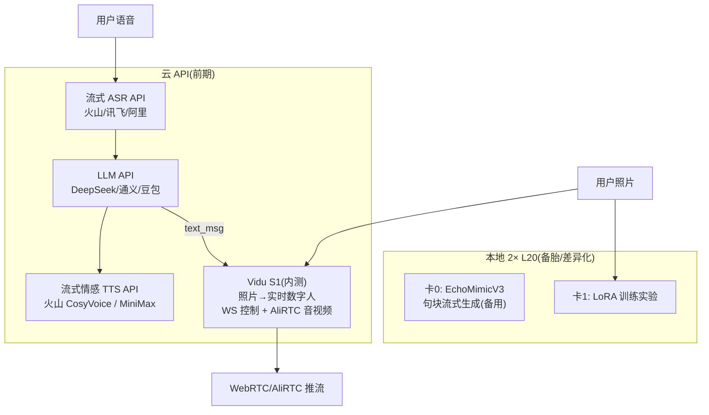
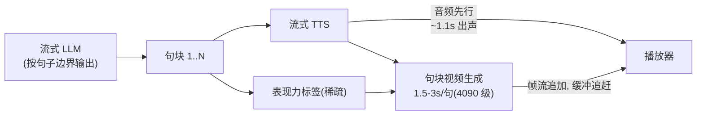

# 照片驱动实时数字人聊天 —— 产品与架构设计

> 创建: 2026-07-31 · 状态: 方案讨论收敛版(待 PoC 验证)
> 前置研究: 见同目录 [`duix-avatar.md`](./duix-avatar.md)(Duix.Avatar 架构分析)

---

## 1. 产品定位

| 维度 | 内容 |
|---|---|
| 形态 | **照片驱动**的 AI 视频实时聊天(数字人对话) |
| 个性化 | 允许 **LoRA 前训练**: 用户上传照片 → 训练形象 → 聊天时加载(不要求零样本) |
| 核心诉求 | **动作、表情、口型与对话内容一致**(内容一致性), 对话由 **LLM 驱动** |
| 硬约束 | **实时**(对话式低延迟, 非批量合成) + **动作表情真实生动** |
| 部署 | 本地 GPU 服务器(2 × NVIDIA L20 48GB)+ WebRTC 推流, 客户端为浏览器/App |

### 1.1 与 Duix.Avatar 的关系(可参考/不可参考)

- **可参考**: 资产模型(形象 + 音色分离, "训练即资产")、训练/合成任务状态机(`waiting → pending → success/failed`)、AI 能力服务化容器部署
- **不可参考**: face2face 视频驱动引擎(闭源 + 视频驱动, 非照片)、非实时任务队列(实时需要流式管线)

---

## 2. 战略原则

> **能用 API 的前期尽量用 API, 精力集中在核心差异化上。**

- ASR / LLM / TTS 前期全部走云 API
- **视频生成也有了云端 API 选项: Vidu S1**(2026-07 发布, 实时交互视频生成, API Beta) —— 前期优先尝试, 本地 L20 方案作为备胎/差异化引擎(见 §3.2)
- LoRA 训练仍必须本地(S1 无训练概念, 纯生成式)
- 所有 API → 本地切换通过 provider 抽象完成, 不碰上层代码

---

## 3. 系统架构总览



### 3.1 环节分工

| 环节 | 前期 | 本地化触发条件 |
|---|---|---|
| ASR | 云 API(流式) | 成本 / 隐私压力 |
| LLM | 云 API(流式) | 同上 + 深度工具/技能集成需求 |
| TTS | 云 API(**流式 + 情感可控**, 见 §4.1) | 成本 / 隐私 / API 情感上限卡住生动性 |
| 视频生成 | **Vidu S1 API(内测)优先, 本地 L20 并行准备** | S1 表现力/个性化/成本不达标时切换本地 |
| LoRA 训练 | **本地**(S1 无训练概念) | — |

### 3.2 Vidu S1: 视频生成首次有了"API 先行"选项(2026-07)

**S1 是什么**: 生数科技(清华朱军团队)2026 年 7 月发布的实时交互式视频生成模型, AR + Diffusion 逐帧生成(非整段合成), 官方 + API 文档确认的能力:

- **照片驱动**: 上传首帧图片创建角色(`avatar.image_uri`), 纯生成式, 无需角色训练
- **实时**: 540P 25FPS(最高 42FPS), 无限时长连续互动, 官方宣称数小时稳定不漂移
- **语音实时控制**: 边听边生成画面/表情/口型/动作; 支持自定义音色与声音克隆(`/live/v1/voices/clone`)
- **API(Beta)**: `POST /live/v1/lives` 创建会话 → WebSocket 控制(`text_msg`/interrupt/hang up)+ AliRTC 媒体通道; 内测入口 platform.vidu.cn/live/landing; 官方集成仓库 shengshu-ai/vidu-s1-api

**为什么之前说"必须本地"的理由需要重估**:

1. 差异化: S1 的表情/动作是**模型内部隐式能力**(语音+文本驱动), 不支持外部显式表现力标签(LLM 稀疏指令通道不可控) —— 这正是本方案 §5.2 的产品差异化点, S1 上做不了精细控制
2. 切换成本: S1 契约(WS + RTC)与本地 EchoMimicV3 完全不同, 但通过 provider 抽象隔离
3. 成本: 按会话计费(有 billing 查询), 前期验证成本远低于自建; 规模化后本地更优

**结论**: S1 内测通过则**前期作为主引擎验证产品**(符合 API 先行战略); 本地 EchoMimicV3/L20 保留为差异化引擎 —— 当"显式表现力控制"或"LoRA 个性化"成为已验证的产品需求时切换。L20 前期用于 LoRA 训练实验与备胎。

---

## 4. 技术选型

### 4.1 云 API(选型标准)

| 环节 | 硬性要求 | 候选 |
|---|---|---|
| ASR | 流式、首包 <300ms、中文优先 | 火山 / 讯飞 / 阿里 |
| LLM | 流式输出(SSE)、低首 token 延迟 | DeepSeek / 通义 / 豆包 |
| TTS | **流式(首包 <300ms)** + **情感/韵律可控**(SSML 或情感参数) | 火山 CosyVoice 大模型音色 / MiniMax 语音 / 讯飞情感合成 |

> TTS 情感控制是**硬性筛选条件**: "表情生动"的 80% 来自音频韵律驱动的隐式表达, 机械平调的合成音会让表情死板。无情感控制的 TTS(如 OpenAI 基础 TTS)直接排除。

### 4.2 视频生成引擎(本地)

| 方案 | 优势 | 劣势 | 结论 |
|---|---|---|---|
| **Vidu S1 API**(生数, 2026-07, Beta 内测) | 照片驱动 + 实时(540P 25-42FPS) + 无限时长 + 语音/文本控制 + 声音克隆, 开箱即用, 无需训练 | 显式表现力控制不可用; 内测/定价/商用条款未定; 依赖第三方 | **前期主选(验证产品)** |
| **EchoMimicV3**(蚂蚁, AAAI 2026, 开源, 1.3B, 12G VRAM 起) | 音频 + **文本 prompt 双条件**驱动口型/表情/手势; 5 步采样近实时; 训练代码开源(LoRA 友好) | 表情控制粒度与时序需验证; 流式需自建管线 | **本地差异化引擎(备胎)** |
| PersonaLive(CVPR 2026, Apache 2.0) | 专为直播设计: 流式 diffusion、无限时长、12GB | 显式控制(文本条件)弱 | 本地备选: V3 流式掉队时切换 |
| FasterLivePortrait | 真实时(ONNX/TensorRT) | landmark 迁移路线, 生动性上限低 | 仅用于 v2 混合渲染补间 |

**引擎接口抽象**: 生成服务暴露统一契约 `(audio_chunk, expression_hints, pose) → 帧流`, 内部实现可换 —— 对应 Orchest provider 墙职责。

---

## 5. 核心链路

### 5.1 实时对话管线(音频先行)



关键规则:
- **音频先行**: 用户感知的"实时" = 语音延迟; 视频首帧落后 1-2s 可接受
- **句块重叠生成**: 第 N 句生成期间第 N+1 句 TTS 已开跑, 生成队列不空转; 稳态判据: **追赶系数 = 句块生成时长 / 音频时长 ≤ 1**
- **播放器缓冲追赶**: 帧流追加播放, 非整段合成

### 5.2 表现力规划(内容一致性核心)

三层一致性, 难度递增:

| 层 | 来源 | 频率 | 作用 |
|---|---|---|---|
| 口型(强绑定) | 音频波形驱动 | 连续 | 成熟解, 非问题 |
| 表情/情绪 | 情感 TTS 韵律(隐式)+ LLM 情感标签(显式, text prompt 通道) | 标签低频 | 情绪匹配 |
| 动作/手势 | LLM 稀疏指令 `[laugh] [nod] [surprise] [gesture:wave]` | 每 2-3 句一次 | 语义级表达, 最弱也最差异化 |

关键设计:
- **隐式为主, 显式为辅**: 高频微表情(眨眼/头部微动/口型精度)由音频韵律自动产生; LLM 标签只做低频语义引导, 防止"表情开关感"
- **平滑层**: 指令时序插值(1-2s 渐变), 禁止突变
- **时间对齐是技术核心**: LLM 分段输出 → 每段过 TTS 取实际时长 → 标签按段锚定时间轴 → 视频增量生成

### 5.3 LoRA 前训练管线

```
用户上传照片 → 训练任务排队(waiting) → 训练(pending, 进度) → 形象资产入库(success)
                                                     ↓
                                          聊天时按用户加载(卡1 产出 → 卡0 使用)
```

- 借鉴 Duix.Avatar 的资产模型: 训练即资产, 资产即产品
- 状态机: 直接复用 `waiting → pending → success/failed` 模式, 语义换成训练任务

---

## 6. 硬件规划(2 × NVIDIA L20 48GB)

L20 关键规格: Ada Lovelace, FP16 119.5 TFLOPS, 864 GB/s, 275W, PCIe 4.0 x16, 无 NVLink(不需要: 跨卡只传小体积音频/指令)。

| 卡 | 用途 | 说明 |
|---|---|---|
| 卡 0 | 视频生成**独占**(S1 验证失败后启用) | diffusion 实时生成不可分时; 单卡 ≈ 1 个活跃会话 |
| 卡 1 | LoRA 训练实验 / 备用 | S1 阶段: 训练实验与效果对比; 本地化后: 第二会话/热备 |

- 双卡真实并发 = **1 主会话 + 1 个(训练/备用/第二会话)**
- 单会话显存预算参考: EchoMimicV3 12-16G(512-768px), 余量充足

---

## 7. 延迟预算(端到端)

| 段 | 预算 | 备注 |
|---|---|---|
| ASR 首包 | <300ms | 云 API 可满足 |
| LLM 首 token | <500ms | — |
| TTS 首包 | <300ms | 云 API + 预留 200ms 抖动缓冲 |
| **用户听到声音** | **~1.1-1.3s** | 音频先行 |
| 视频首帧 | 落后语音 1-2s | 缓冲追赶, 可接受 |

---

## 8. 前期范围

### 只做三件事

1. **表现力规划协议**(Orchest 事件流扩展): LLM 输出 = 文本 + 稀疏情感/动作标签, 时序对齐 —— "生动"的源头, 最优先
2. **句块流式视频管线**: 音频 chunk 进 → 帧流出 → 缓冲追赶, 跑通"实时"硬指标
3. **LoRA 训练管线**: 照片 → 训练任务 → 形象资产入库

### 明确不做(验证后按需加)

本地 ASR/TTS/LLM、多会话并发、混合渲染(关键帧 + warp 补间)、手势细粒度控制、实时互动高级功能。

### 里程碑

- **W0 — S1 接入**: 提交内测申请; 通过后接 `POST /live/v1/lives` + WS + AliRTC, 跑通"照片创建角色 → 文本驱动对话 → RTC 音视频回传"
- **W1 PoC — 实时性与生动性(双轨)**: S1 实测(延迟/表情自然度/稳定性/成本); 同时 L20 + EchoMimicV3 句块流式测追赶系数(>1.2 换 PersonaLive)作为对照
- **W2 — 差异化评测**: 双盲真人评测对比 S1 与本地(显式稀疏标签 vs 隐式), 决定主引擎与显式层投入
- **W3-4 — 端到端 demo**: Orchest 编排 + 云 provider + 视频生成(S1 或本地)+ 前端, 跑通完整对话

---

## 9. Orchest 对接点

1. **provider-http**: ASR / LLM / TTS 三个 API provider, 同一能力接口一套实现 —— 前期产品主体
2. **provider-visual(本地, 唯一自研)**: 流式 talking-head 生成, 契约 `(audio_chunk, expression_hints) → 帧流`
3. **表现力规划作为协议能力**: agent 事件流增加 expression/gesture 元数据(结构化 + 流式), 可迭代提示词封装为 Skill
4. **API → 本地切换**: provider 墙按能力查询选择, 切换不碰上层代码

---

## 10. 风险与验证

| 风险 | 缓解 |
|---|---|
| EchoMimicV3 表情控制粒度不足/时序不对齐 | W2 双盲评测; 备选: 补 landmark 控制层 |
| 长会话表情漂移(drift) | PoC 中做 10 分钟以上会话稳定性测试 |
| diffusion 流式掉队(追赶系数 >1) | 句块重叠 + teacache/帧缓存; 掉队严重换 PersonaLive |
| 云 TTS 情感上限卡住生动性 | 选型时核对情感能力; 压力出现后本地化(CosyVoice/Fish-Speech) |
| API 成本(多会话) | 预留 provider 切换开关, 成本模型按分钟计 |
| **S1 内测不通过 / 定价过高 / 商用条款受限** | 申请后即启动本地 EchoMimicV3 管线并行准备; 决策点: 2 周内无结论则本地优先 |
| **S1 显式表现力不可控, 差异化被锁死** | W2 生动性评测时对比 S1 vs 本地; 若"LLM 稀疏标签"显著胜出, 转本地主引擎 |
| **S1 依赖第三方(稳定性/数据出网)** | 会话级监控; 数据敏感场景直接走本地 |

---

## 附: 参考材料

- Duix.Avatar 架构分析: [`duix-avatar.md`](./duix-avatar.md)
- **Vidu S1**(2026-07 发布): 生数科技实时交互视频生成, AR+Diffusion 逐帧, 540P 25-42FPS, 无限时长; API Beta: `POST /live/v1/lives` + WS 控制 + AliRTC; 官方集成仓库 shengshu-ai/vidu-s1-api; 内测入口 platform.vidu.cn/live/landing
- EchoMimicV3(AAAI 2026): antgroup/echomimic_v3, 1.3B, 音频+文本双条件
- PersonaLive(CVPR 2026): GVCLab/PersonaLive, 流式 diffusion, Apache 2.0
- FasterLivePortrait: warmshao/FasterLivePortrait, ONNX/TensorRT 实时
