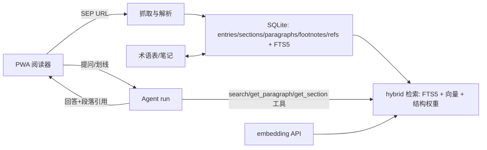

# SEP Reader Demo 规划（Demo C 候选）

> 状态：**候选规划，未排期**。若排期为迭代，建议编号 v0.18，目录 `docs/iteration/v0_18/`，并按
> WORKFLOW 拆 issues。本文档基于 2026-08-01 的产品分析讨论稿整理，设计决策以本文档为准。

## 背景

v1.0 前的 demo 验证策略已执行两轮，均为 **Rust CLI** 形态：

- **Demo A（v0.10）Briefing Desk** —— 能力组合广度：LLM/ASR/TTS/多模态图像输入、approval、
  session、Agent-as-Tool reviewer。
- **Demo B（v0.11）Research Pipeline** —— Supervised Delegation 深度：watcher、steering、
  ContextMode、failure escalation、findings 契约。

两轮 demo 覆盖的是「单次任务」型 agent 产品。尚未被真实产品验证的公开面：

1. **TS SDK（`@orchest/sdk`，napi-rs 绑定）** —— 绑定层是最容易与 Rust 核心脱节的表面
   （类型导出、事件形状、异步语义），但两个 demo 都未触碰。
2. **检索密集型 agent** —— 既有工具面是文件系统/媒体处理；全文检索、结构导航、段落定位是
   另一类工具负载，`ToolRegistry` 的 schema/description 质量在检索场景下的影响从未被检验。
3. **`messages` 多轮快照契约** —— TS SDK 无 SessionStore API，跨进程 resume 依赖
   `runSync(input, messages)` 的历史快照形状；该契约从未被真实产品消费。
4. **Skill 渐进式披露的消费侧** —— v0.14 落地了零配置渐进式披露，但尚无应用消费 skill
   元数据与 `load_skill` 的例子。

**SEP Reader** 是 Demo C 候选：一个本地优先的个人哲学阅读助手，把 SEP（Stanford Encyclopedia
of Philosophy）条目变成可检索、可标注、可追问的阅读空间。它验证「长期、检索密集、多轮
grounding」这一产品切片，与 A/B 互补，且刻意选择 TS 栈以覆盖绑定层。

## 产品定位

- 本地优先：原文缓存在用户设备（SQLite），AI 只接收当前段落、邻近上下文与检索片段。
- 差异化核心不是「RAG 问答」，而是三个能力：
  1. **困惑定位**：把自然语言困惑分类后定位到精确章节/段落；
  2. **论证角色解释**：解释当前段落在整篇论证中的作用；
  3. **最小必要背景**：根据用户已有理解补齐缺失前提。
- 版权边界是硬约束（见下节），产品形态是「SEP 的增强阅读层」，不是镜像或替代站。

## 版权边界（硬约束）

SEP 开放访问但**非开放许可**：正文版权归 Metaphysics Research Lab，条目作者保留部分权利；
不是 Wikipedia 式 CC BY-SA 内容。因此：

- 个人缓存、划线、笔记、翻译：低风险，可做。
- 公开再发布全文/整篇译文：需要许可，**不做**。
- 无官方内容 API；非官方 `writeonlycode/sep-api` 只是网页抓取包装，**不依赖**，直接解析 HTML。
- SEP 有季度历史归档（Spring/Summer/Fall/Winter 固定版本），条目可绑定明确版本，不依赖
  不断变化的当前页。

Demo 与未来产品一律遵守：不预置 SEP 全文、用户访问/导入时才缓存、缓存不公开分享、始终显示
来源与 SEP 链接、AI 回答只展示必要短引文并以定位链接为主、翻译默认属于个人私有笔记、
不提供「导出整套中文版」。

## 技术栈决策

| 层 | 选择 | 理由 |
|---|---|---|
| 前端 | React + Vite PWA | 手机友好阅读 + 可加主屏幕；比 Next.js 轻，符合一周原型 |
| 后端 | Node + Express，进程内持有 `Agent` | 刻意走 TS SDK，覆盖 napi-rs 绑定面 |
| 存储 | SQLite（better-sqlite3），FTS5 | 本地优先；better-sqlite3 自带 FTS5 |
| 向量 | 外部 embedding API（应用层直连），向量存 SQLite | 语料小，暴力余弦足够；SDK 无 embedding 能力，属应用层 |
| LLM | `@orchest/sdk` Agent + 现有 provider | Anthropic/DeepSeek/OpenRouter 之一 |
| 离线 smoke | mock LLM 端点 | TS SDK 无 fake model 暴露，应用层 mock 覆盖确定性路径 |

## 架构



### 内容获取层（两级缓存）

1. 用户打开 SEP URL → 抓取该文章 → 解析 → 缓存；不镜像整个语料库。
2. 解析并缓存：标题、作者、首次发表/修订日期、章节树、正文段落、脚注、参考文献、相关文章。
3. 后续按需下载链接文章。
4. 条目绑定季度归档版本（如 `Fall 2025`），`archive_version` 字段记录。

### 数据模型（核心不变量：稳定 paragraph_id）

```json
{
  "entry_id": "deleuze",
  "source_url": "…",
  "archive_version": "current",
  "title": "Gilles Deleuze",
  "authors": [],
  "published_at": "…",
  "revised_at": "…",
  "sections": [
    {
      "id": "sec-1",
      "heading": "Life",
      "paragraphs": [
        { "id": "p-1", "html": "…", "plain_text": "…", "start_offset": 0 }
      ]
    }
  ]
}
```

- paragraph_id 由 DOM 结构路径 + 内容 hash 生成（同页两次解析 id 一致）。
- **划线、笔记、翻译、AI 对话全部绑定 paragraph_id**，不绑定屏幕坐标。

### 检索层（三种索引）

1. **结构索引**（SQLite 关系表）：章节/段落/脚注/参考文献/相关文章。回答「这个概念在哪里
   定义」「这一节的前提来自哪里」「作者后面是否回应了这个反对意见」。
2. **全文 + 语义索引**：FTS5 + embedding 向量并存。哲学检索不能只靠 embedding —— 专有术语、
   拉丁语、德语词、人名，BM25 往往更可靠。hybrid 打分：
   `final = 0.45·semantic + 0.35·lexical + 0.20·structural`。
3. **概念图索引**：**不在 MVP 做**。第一版只抽 `Entry→Section`、`Entry→Related Entry`、
   `Paragraph→Mentions Concept/Philosopher`、`Claim→Objection` 中前两类（后两类依赖抽取
   LLM/NER，排入阶段二）。

### 困惑定位（query classifier）

提问先分类，再走不同检索策略：

| 类别 | 检索策略 |
|---|---|
| `term_definition` | 结构索引定位定义段落 + FTS 命中 |
| `argument_gap` | 当前段 ±2–4 段 + 章节摘要 + 全文共现 |
| `background_missing` | 当前段 + 相关条目定义（跳条目） |
| `position_comparison` | 两立场在全文的位置集合 + 结构索引 |
| `objection` | 检索「反对」「回应」语义段落 |
| `related_entry` | 结构索引的 related entries + 定义检索 |

回答必须：标注哪些是原文、哪些是解释模型的重构；引用段落用 paragraph_id 定位。

### 翻译三层

- 原文 / 机器译文 / 术语表 + 用户修订，分开存储。
- 术语条目：`preferred_translation` / `alternatives` / `note`；阅读模式首现显示
  「随附性（supervenience）」，后续只显示译文，点击展开术语说明。
- 争议术语（sense/reference、Being/being、différance 等）允许保留原文、固定个人译法、
  查看其他译法，不强制一种。
- 翻译以段落为单位，但把章节标题 + 上一段 + 下一段一起提供给模型，防止代词与术语漂移。

### 阅读交互（MVP 子集）

- 正文安静、类电子书：字号/行距/主题、章节目录、阅读进度、原文/译文切换、脚注浮层。
- 划线后弹出 ≤5 个入口：**解释这段 / 翻译 / 它在论证中起什么作用 / 相关背景 / 提问**。
- 「解释这段」分层输出：① 一句话释义 → ② 大意 → ③ 依赖前提 → ④ 与前后文连接 → ⑤ 深入 →
  ⑥ 争议/反对意见。
- 提问面板返回「最相关位置 + 前置阅读 + 可能混淆」三块，带定位。

## SDK 能力验证面

| 能力 | Demo 用法 | 预期 |
|---|---|---|
| TS `Agent` 构造/run | 后端 Node 进程持有 Agent，处理解释/翻译/提问 | runSync/runStream 走通 |
| TS `ToolRegistry` | `search_paragraphs` / `get_paragraph` / `get_section` / `get_entry` / `search_related` 检索工具 | schema+handler 全链路 |
| `runStream` | 回答流式渲染（打字机） | 事件形状稳定可用 |
| `messages` 多轮 resume | 对话历史 JSON 持久化于 SQLite，重开会话以 `messages` 恢复 | 跨进程 resume 契约成立 |
| approval | 写笔记/导出时 approval 门（`sideEffect: true`） | `respondApproval` 路径 |
| skill 渐进式披露 | stretch：阅读提示 skill | `skill_content_read` 事件 |
| async tool | stretch：长条目抓取/解析 | `async_tool_*` 事件 |

**预期 gap 候选**（记录为 findings，不预先修改 runtime）：

- TS SDK 无 SessionStore/run resume API —— resume 只能靠应用层 `messages` 快照；若快照形状
  不适配多轮带工具历史，即为 seam finding。
- TS 无 fake model 暴露 —— 离线 smoke 需应用层 mock 端点。
- 无 embedding 能力 —— 应用层直连，属合理边界。

## MVP 范围（阶段一，一周原型）

用户流程：

1. 输入 SEP URL → 抓取 → 解析 → 入库（两级缓存）。
2. 手机友好阅读（PWA），断网可读已缓存条目。
3. 划线 → 五个入口之一 → 分层解释 / 段落级翻译。
4. 针对当前文章提问 → query classifier → hybrid 检索 → 回答带 paragraph_id 引用。
5. 笔记绑定段落；重开浏览器后对话与笔记仍在。

fixture 使用**自研仿 SEP 结构文本**（不复制真实条目，规避版权），含 3 个条目、章节/段落/脚注/
参考文献齐全，作为解析、检索、回答引用的确定性测试语料。

## 阶段二/三（明确超出 MVP）

- 阶段二：跨条目语义搜索、问题自动定位相关章节、概念卡片、条目关系图、阅读历史、
  个性化术语表、缺少前置知识提示、困惑→阅读路径。
- 阶段三：记忆个人理解状态、发现反复卡住的概念、区分「不懂」与「不同意」、
  跨条目观点比较、SEP/原著/论文同一阅读空间。

## 候选 Issue 分解

| Issue | 标题 | 范围 |
|-------|------|------|
| 001 | Demo 契约与 fixtures | 用户流程锁定、仿 SEP fixture 语料、expected outputs、验证 rubric |
| 002 | 抓取与解析 | SEP DOM parser、两级缓存、entry schema、稳定 paragraph_id、归档版本绑定 |
| 003 | 存储与检索 | SQLite schema、FTS5、embedding 入库、hybrid 打分（确定性测试） |
| 004 | 阅读 PWA | 安静阅读、目录/进度/脚注浮层、划线、笔记、术语表 |
| 005 | AI 辅助 | query classifier、分层解释、翻译三层、回答引用契约、`messages` resume |
| 006 | 验证报告 | 全流程 smoke、TS 绑定摩擦记录、gap 三分类（demo blocker / release blocker / post-1.0） |

## 验收标准

- [ ] `examples/demo/sep-reader/` 存在，`npm run build:native` + 应用构建通过（workspace 内 TS demo 结构）。
- [ ] 输入 fixture URL 后条目入库，title/authors/dates/sections/paragraphs/footnotes/refs 字段齐全。
- [ ] 同一条目解析两次，paragraph_id 完全一致（确定性）。
- [ ] 断网（mock 网络失败）时已缓存条目可完整阅读。
- [ ] FTS5 检索在 fixture 上命中断言通过；hybrid 打分结果可复现（确定性测试）。
- [ ] 划线入口数量 ≤5；分层解释输出包含 ①–⑥ 六层结构（fixture 断言）。
- [ ] 提问回答包含 paragraph_id 引用，且区分原文/模型重构（断言输出契约）。
- [ ] 翻译以段落为单位，输入含章节标题 + 前后段；术语表首现带英文标注。
- [ ] 重开浏览器后对话可续（`messages` 快照恢复），笔记不丢失。
- [ ] 版权边界自检：不预置全文、不导出整套、回答仅短引文。
- [ ] 验证报告记录 TS 绑定摩擦、`messages` resume 契约结论与 gap 分类。

## 验证方式

```bash
cd examples/demo/sep-reader && npm install
npm run build:native          # 构建 @orchest/sdk 原生插件
npm test                      # vitest：解析/检索/回答契约确定性测试（mock LLM 端点）
npm run smoke                 # 全流程 smoke：抓取→缓存→阅读→划线→提问→resume
```

Rust workspace 预计无改动（纯 TS demo）；若验证发现 release blocker 级问题，按 v0.10 的
triage 规则进入独立 issue。手动 live 运行（真实 LLM）env-var 门控，记录 provider/model/日期/结果。

## 风险

| 风险 | 缓解 |
|---|---|
| SEP HTML 结构变动导致解析器脆弱 | 绑定归档版本 + DOM 结构快照测试；解析失败显式报错不静默 |
| 无官方 API | 直接解析 HTML；不依赖第三方包装 |
| 版权越界 | 上文硬约束 + fixture 不复制真实内容；报告里做自检清单 |
| TS SDK 事件/API 缺口 | 记录 findings 并按 triage 分类，不在 demo 里绕 runtime |
| embedding API 依赖 | 语料小 + 向量可缓存；无 embedding 时降级纯 FTS5（hybrid 权重归零） |

## 与既有 demo 的关系

| Demo | 迭代 | 验证轴 | 形态 |
|---|---|---|---|
| A Briefing Desk | v0.10 | 模态广度 | Rust CLI |
| B Research Pipeline | v0.11 | 委派深度 | Rust CLI |
| C SEP Reader（候选） | v0.18（若排期） | TS 绑定 + 检索密集 + 多轮 grounding | TS / PWA |

Demo C 不进入 v1.0 依赖链（与 v0.16 相同定位：非阻塞、独立实验）。排期前需确认：① 优先级
（v1.0 前或发布后）；② 是否接受 TS demo 的验证报告作为绑定层冻结证据。
